# Chapter 3: Supervised Learning

---

## Supervised Learning: Robot Arm Failure Prediction


---

**Supervised Learning** — Machine learning where each training example includes both inputs and the correct answer label.

---

## Classification & Regression


---

### Concept: Classification & Regression
Every supervised learning problem falls into one of two types. **Classification** predicts a category - the machine either failed or it did not, the email is spam or it is not, the image shows a cat or a dog. The answer is always one choice from a fixed list. **Regression** predicts a number - how many hours until the machine fails, what the temperature will be tomorrow, how fast the robot should move. The answer can be any value on a continuous scale.
In this chapter the problem is classification: given five sensor readings from a CNC machine, predict whether the machine is about to fail. The correct answer for each row of training data is already known - an engineer labeled it. The model learns by seeing thousands of **sensor readings → failure/normal** pairs and adjusting its internal numbers until it can predict the label from the sensors alone.
Input features → Model prediction → Compare to label, adjust, repeat
**Features**
The five input columns the model uses to make its prediction: air temperature (K), process temperature (K), rotational speed (rpm), torque (Nm), and tool wear (min). Each row in the dataset is one moment in time - a snapshot of what the machine was doing. These are the inputs. The model sees these numbers and must output a prediction.
**Labels**
The column the model is trying to predict: Machine failure (0 = normal, 1 = failed). This is what a human engineer already knows for every row in the training set. The model learns by comparing its prediction to this true label and adjusting until the two agree. At prediction time on new data, this column does not exist - the model must infer it from the features alone.

### Why we split into training and test sets
You cannot evaluate a model on the same data it learned from. A student who memorizes every past exam paper will score 100% when given those same papers again - but will fail on a new exam because they memorized answers instead of understanding the subject. A model has the same failure mode. If you train and evaluate on the same data, the model looks perfect. On new real-world data it fails completely.
The solution is to hide some data before training starts. The training set (typically 80% of the data) is what the model learns from. The test set (20%) is sealed away and only used once at the very end to evaluate true performance. The test score is the only honest measure of whether the model actually learned the pattern or just memorized the training examples.
!!! info "The 80/20 split is a starting point, not a rule"
    With 10,000 rows, like the AI4I dataset, 2,000 test rows gives a reliable estimate. With only 200 rows, you might use 90/10. With millions of rows you might use 99/1 - 10,000 test rows is already plenty for a reliable estimate. Match the split to your dataset size, not to a fixed percentage.

### How do you measure if a model is good?
The obvious answer is accuracy - what percentage of predictions were correct? But accuracy is dangerously misleading for imbalanced datasets. The AI4I dataset has about 3.4% failures and 96.6% normal readings. A model that always predicts `normal` achieves 96.6% accuracy - while catching exactly zero failures. That model is completely useless. You need better metrics.
The metrics below are built from four counts, where *positive* means the model predicted `failure`: **TP** = True Positive (predicted failure, was a failure), **TN** = True Negative (predicted normal, was normal), **FP** = False Positive (predicted failure, was actually normal - a false alarm), and **FN** = False Negative (predicted normal, was actually a failure - a missed failure).
**Accuracy** — `Accuracy = correct predictions / total predictions`

Correct predictions means: predicted normal and was normal, or predicted failure and was failure. Misleading when one class is much rarer than the other. A model predicting `normal` every time on AI4I gets 96.6% accuracy with zero engineering value. Use accuracy only when your classes are roughly balanced.

**Precision** — `Precision = TP / (TP + FP)`

Of every time the model said `failure`, how often was it actually a failure? High precision means few false alarms. A factory floor wants high precision: if the model constantly cries wolf, engineers stop trusting it and ignore real alerts. Low precision means the maintenance team gets called out for nothing.

**Recall or Sensitivity** — `Recall = TP / (TP + FN)`

Of every actual failure that happened, how many did the model catch? High recall means few missed failures. A factory wants high recall: missing a real failure means an unexpected breakdown, downtime, and cost. Low recall means failures slip through undetected. Also called sensitivity or true positive rate.

**F1-score** — `F1 = 2 × (precision × recall) / (precision + recall)`

The harmonic mean of precision and recall. It is low if either precision or recall is low - you cannot fake a good F1 score by sacrificing one for the other. For imbalanced classification problems like failure prediction, F1 is the headline metric. A model with F1 = 0.85 is genuinely catching most failures without too many false alarms. Use this as your primary target.

### The precision-recall tradeoff
Precision and recall pull in opposite directions. If you lower the model's decision threshold - predicting `failure` more aggressively - you catch more real failures, so recall goes up, but also trigger more false alarms, so precision goes down. If you raise the threshold - predicting `failure` only when very confident - false alarms drop, so precision goes up, but some real failures are missed, so recall goes down.
Which matters more depends on the cost of each mistake. For a medical diagnosis, missing a real disease is far worse than a false alarm that leads to an unnecessary test. For a spam filter, a false alarm, meaning a real email marked as spam, might be worse than missing some spam. For predictive maintenance, most engineers weight recall more heavily - a missed breakdown costs more than an unnecessary maintenance check.
!!! warning "Do not optimize accuracy alone"
    Never optimize for accuracy alone on an imbalanced dataset. Always report precision, recall, and F1.

### The confusion matrix
The confusion matrix shows all four possible outcomes of a binary classifier in one table. Every prediction the model makes falls into exactly one of the four cells. Reading the matrix tells you not just how accurate the model is but exactly what kind of mistakes it makes - and the two types of mistakes have very different consequences.
Rows represent what actually happened. Columns represent what the model predicted. The diagonal, top-left and bottom-right, is where the model was right. The off-diagonal, top-right and bottom-left, is where it was wrong.
|  | Predicted Normal | Predicted Failure |
|--|-----------------|------------------|
| **Actual Normal** | True Negative — Correctly ignored healthy machine | False Positive — False alarm |
| **Actual Failure** | False Negative — Missed failure | True Positive — Caught failure |

### Reading metrics from the matrix
**Let:**

- `TP` = True Positives (bottom-right cell)
- `TN` = True Negatives (top-left cell)
- `FP` = False Positives (top-right cell — false alarm)
- `FN` = False Negatives (bottom-left cell — missed failure)

**Then:**

- `Accuracy` = (`TP` + `TN`) / (`TP` + `TN` + `FP` + `FN`)
- `Precision` = `TP` / (`TP` + `FP`)
- `Recall` = `TP` / (`TP` + `FN`)
- `F1` = 2 × `TP` / (2 × `TP` + `FP` + `FN`)
!!! tip "Concrete numbers"
    Say your model evaluates on 2,000 test rows: 1,932 normal readings and 68 failure readings.
    The model predicts: `TN = 1920` correctly said normal, `TP = 45` correctly caught failures, `FP = 12` false alarms, and `FN = 23` missed failures.
    Then: `Accuracy = (1920+45) / 2000 = 98.25%`, which looks great but is misleading. `Precision = 45 / (45+12) = 78.9%`. `Recall = 45 / (45+23) = 66.2%`, meaning the model catches only about two-thirds of failures. `F1 = 2×45 / (90+35) = 72.0%`.
    The accuracy of 98.25% sounds excellent. But the recall of 66.2% means one in three real failures is being missed completely. This is why you always look at the full confusion matrix.
!!! tip "Why this matters for robot maintenance"
    A robot that breaks down unexpectedly stops production. An engineer who gets 50 false alarms per day stops trusting the system and turns it off. The precision-recall tradeoff is not an abstract mathematical concept - it is a real engineering decision with real costs on both sides. The model you build in the next section will need to balance these two failure modes for the specific cost structure of your use case.

---

## Key Algorithms


---

### Key Algorithms Explained
You have labeled data. You want a model that can predict the label for new examples. But which algorithm do you use? There is no single correct answer - each algorithm makes different assumptions about the shape of the patterns in your data. Understanding what each one assumes helps you choose wisely and interpret the results honestly.
All four algorithms below are classification algorithms - they predict a category, failure versus normal, rather than a number. They all take the same input, a row of features, and produce the same output, a predicted class. The difference is **how** they make that prediction internally.
| Algorithm | Type | Interpretable | Speed | Best For |
|-----------|------|:-------------:|:-----:|----------|
| Logistic Regression | Linear classifier | High | Fast | Baselines and explanations |
| Decision Tree | Tree classifier | High | Fast | Readable rules |
| Random Forest | Ensemble | Medium | Medium | Strong tabular accuracy |
| Support Vector Machine | Margin classifier | Medium | Medium | Smaller clean datasets |

### How do you choose?
Start with logistic regression as your baseline. It trains in seconds and tells you immediately whether the problem has a linear pattern. If it gets 90% F1 score, you might not need anything more complex. If it gets 65%, you know the pattern is non-linear and you need a tree-based method.
Then try Random Forest. It almost always outperforms a single decision tree and requires very little tuning. If you need to explain predictions to non-technical stakeholders, add a single decision tree as an interpretable backup - even if it is not the most accurate model, it shows the rules in plain language.
SVM is worth trying when your dataset is small and clean. On larger datasets Random Forest typically wins on both speed and accuracy.
1. **Always train logistic regression first as a baseline.** If accuracy is good enough, stop here.
2. **Try Random Forest.** Compare it to logistic regression on validation F1 score. It usually wins on complex data.
3. **Try a single Decision Tree if you need interpretability.** Accept the accuracy trade-off if explanation is required.
4. **Try SVM if the dataset is small.** Use it when you have under 10,000 rows and Random Forest is not generalizing well.

| | Interpretable | Performance |
|--|:-------------:|:-----------:|
| **Simple** | Logistic Regression | Support Vector Machine |
| **Complex** | Decision Tree | Random Forest |

### A note on the word 'best'
No algorithm is universally best. This is formalized in the No Free Lunch theorem - any algorithm that outperforms another on some problems must underperform on others. Random Forest tends to win on tabular data in practice, which is why it is the first choice here. But on the AI4I dataset with 10,000 rows and five features, logistic regression often comes surprisingly close to Random Forest. The lesson: always compare multiple algorithms on your specific data rather than assuming one is always superior.
!!! tip "Algorithm choice is an engineering decision"
    In a real predictive maintenance deployment, the choice of algorithm depends on more than accuracy. If a maintenance engineer needs to explain to management why a machine was flagged for service, a decision tree provides auditable rules. If pure accuracy is what matters and no explanation is needed, Random Forest wins. Choosing an algorithm includes human and organizational factors, not just a math problem.

---

## Logistic Regression


---

Logistic regression is the simplest of the four classifiers - start here, then compare to the others in the [overview](?lesson=ch3-algorithms).
**Type:** Linear classifier
**Output:** Probability (0 to 1)
**Interpretable:** Yes
**Speed:** Very fast


Logistic regression learns a probability surface, then turns that probability into a normal or failure prediction.

Despite the name, logistic regression is a classifier, not a regressor. The name comes from the logistic, or sigmoid, function it uses internally, not from the type of output it produces.
How it works: it draws a straight line, or in higher dimensions a flat plane called a hyperplane, that separates the two classes. Every data point on one side is classified as normal, every point on the other side as failure. The line is chosen to maximize the probability of the training labels being correct.
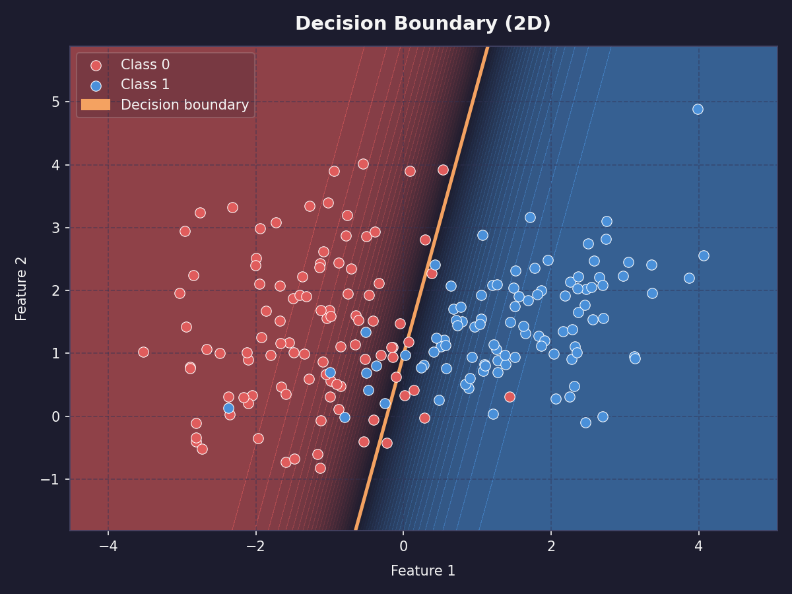


A straight decision boundary divides the feature space into normal and failure regions.

The output is a probability between 0 and 1 - values above 0.5 become class 1, below 0.5 become class 0.
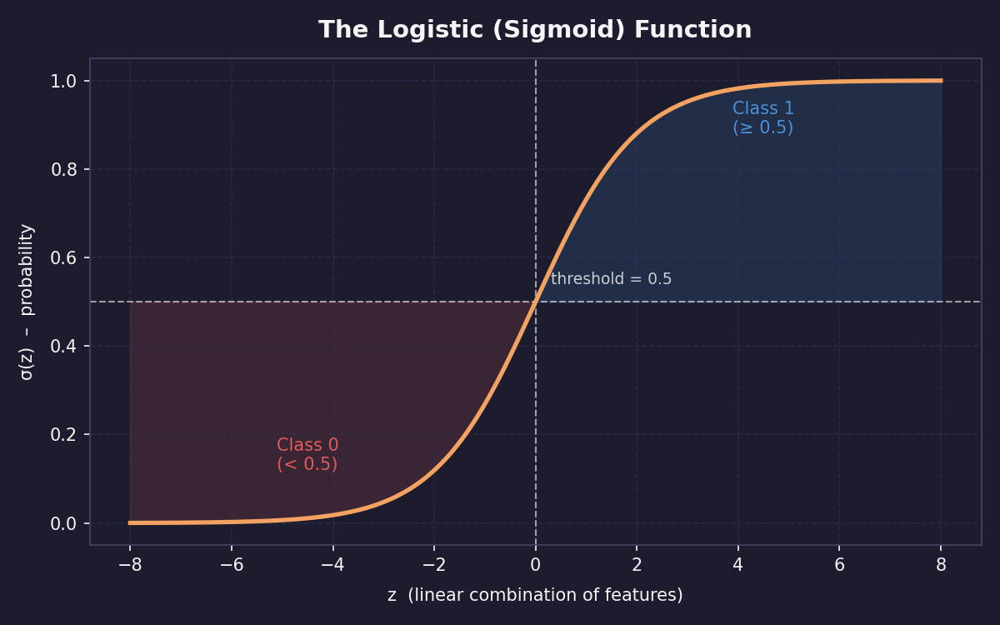


The sigmoid function turns any score into a probability, with 0.5 as the usual decision threshold.

Real example: on a factory robot arm, logistic regression might learn that failure probability increases linearly with torque and tool wear. It cannot capture `failure only happens when both torque and temperature are high simultaneously` - that interaction requires a more complex model.
**What "linear with torque and tool wear" means**

Suppose the model learns this score equation:
```
z = -8 + 2.3T + 1.7W
P(failure) = σ(z) = 1 / (1 + e-z)
```

The score equation feeds the sigmoid curve, converting feature values into failure probabilities.
Here, `T` is torque and `W` is tool wear. The first equation is linear because the feature terms are added with weights. There is no term that multiplies two features together.

**What the interaction would require**

Failure may not depend on torque alone or temperature alone. Instead, failure might depend on their combination. To capture that, add an interaction feature such as `Torque × Temperature`:
```
z = b0 + b1(Torque) + b2(Temperature)
    + b3(Torque × Temperature)
```

A logistic regression boundary is always straight unless you manually add new interaction features. Models like decision trees can draw stepped or curved-looking boundaries from the data instead. Or use a more complex model, such as a decision tree, random forest, gradient boosting model, or neural network.

What it gives you: the weight, or coefficient, for each feature. A weight of +2.3 on torque means higher torque strongly increases failure probability. A weight near 0 means that feature barely matters. This makes logistic regression one of the most interpretable models that exists.

**Use when:** you want a fast interpretable baseline, you need to explain which features drive failures, or your data is roughly linearly separable.

**Do not use when:** the relationship between features and the label involves complex interactions or non-linear patterns.

---

## Decision Tree


---

Decision trees are more powerful than logistic regression on non-linear data, and more readable than any other algorithm in this chapter.
**Type:** Tree-based classifier
**Output:** Class + readable rules
**Interpretable:** Yes
**Speed:** Fast


A decision tree tests possible thresholds and chooses the split that makes the child groups as pure as possible.

A decision tree is a flowchart the algorithm builds automatically from your training data. At each step it asks one yes/no question about a feature, splits the data into two groups, and repeats until it can make a confident prediction.
How it works: the algorithm searches for the single feature and threshold that best separates failures from normal readings. For example, `is tool wear > 180 minutes?` splits the data so that most failures are on the yes side. It then repeats this for each sub-group independently, building a tree of questions. At each leaf, the bottom of a branch, it outputs the majority class of the training examples that ended up there.
Real example: a robot maintenance tree might first ask whether tool wear is high. If yes, it may ask whether torque is also high. If no, it may check temperature difference. The final leaves are the predicted classes.
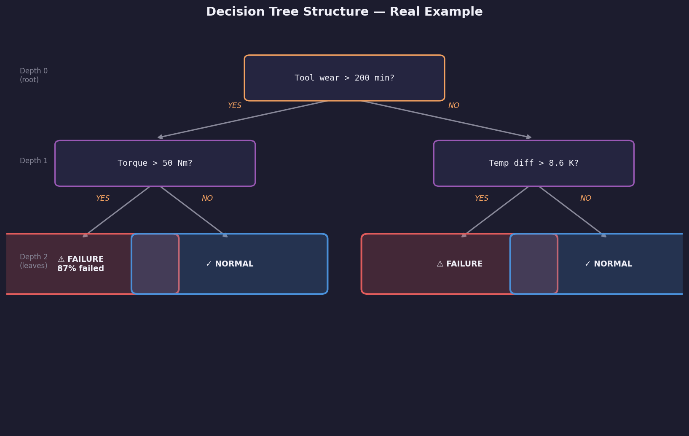


The final model is a readable tree of questions, arrows, and class predictions.

What it gives you: a human-readable set of rules. You can print the tree and show it to a maintenance engineer who has never heard of machine learning. They can follow the branches manually and understand why the model made each decision.
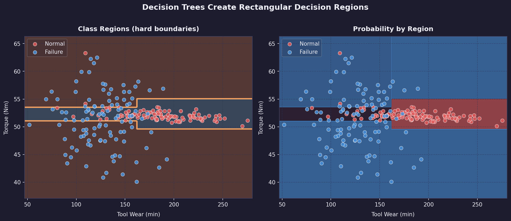


Because each split is a threshold on one feature, decision trees carve the feature space into rectangular regions.

The main control knob is tree depth. A shallow tree may underfit because it asks too few questions. A very deep tree may overfit because it memorizes tiny quirks in the training set instead of learning a stable pattern.
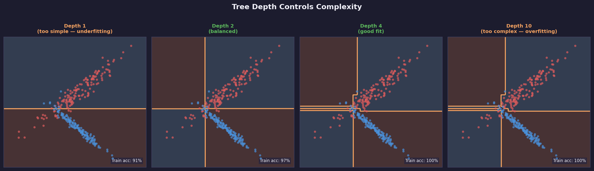


Depth controls complexity: too shallow misses structure, too deep memorizes noise, and the best model is usually in between.

**Use when:** the rules need to be understood and validated by a domain expert, or you want to discover key threshold values like failures mostly happening above 200 minutes of tool wear.

**Do not use when:** your data has many features with complex interactions. A single tree tends to overfit - it memorizes the training data by growing too many branches. This is why Random Forest exists.

---

## Random Forest


---

Random Forest fixes the main weakness of a single decision tree - this is usually the first algorithm to try on any new tabular dataset.
**Type:** Ensemble (100+ trees)
**Output:** Class + confidence %
**Interpretable:** Medium
**Speed:** Medium


Random Forest fixes the main weakness of a single decision tree: one tree can overfit, but many varied trees vote toward a steadier prediction.

A random forest fixes the main weakness of a single decision tree, overfitting, by training hundreds of trees and having them vote. The final prediction is the majority vote across all trees.
Each tree is trained on a random sample of the training data and uses a random subset of features at each split. This randomness makes each tree slightly different, which is exactly what makes the group more reliable than one tree alone.
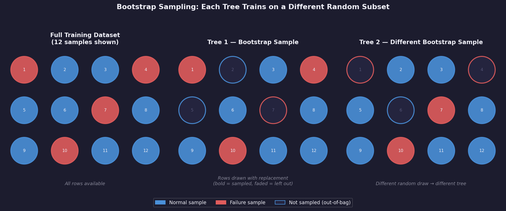


Bootstrap sampling means each tree sees a different version of the dataset, so their mistakes are less likely to be identical.

How it works: imagine 100 decision trees, each trained on a slightly different random sample of your 8,000 training rows. For a new sensor reading, each tree makes its own prediction. If 73 trees say `failure` and 27 say `normal`, the forest predicts failure with 73% confidence. The diversity of trees means one tree's quirky overfitting gets outvoted by the crowd.


The forest prediction is a vote: here, 73 trees vote failure and 27 vote normal, so the model predicts failure with 73% confidence.

Real example: one tree might overfit to a specific pattern of high temperature and low torque that appeared in its training sample. The other 99 trees were not trained on that exact sample and vote it down. The ensemble is much more robust than any individual tree.
What it gives you: a confidence score, the vote percentage, and feature importance scores - a ranked list of which features the trees used most often for their splits. In the AI4I dataset, tool wear typically ranks as the most important feature for predicting failure.
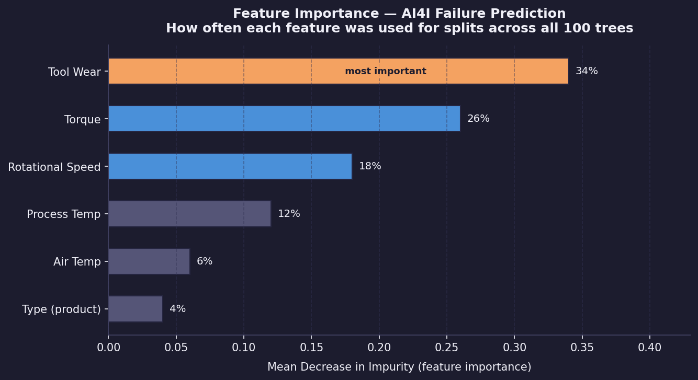


Feature importance summarizes which inputs the forest relied on most often; for this maintenance example, tool wear is the strongest signal.

**Use when:** you want strong accuracy on tabular data without heavy tuning. Random Forest is the first algorithm to try on many new classification problems because it is robust and rarely makes catastrophically wrong predictions.

**Do not use when:** you need to explain exactly why the model made a specific prediction, because the 100 trees are hard to interpret together, or when you have very high-dimensional sparse data like text.

---

## Support Vector Machine


---

Support Vector Machines take a fundamentally different approach - instead of building rules or trees, they find the widest possible gap between classes.
**Type:** Margin classifier
**Output:** Class
**Interpretable:** Medium
**Speed:** Medium (slow on large data)


SVM does not choose just any separating line. It chooses the line with the widest margin between the closest points from each class.

A Support Vector Machine, or SVM, finds the widest possible empty gap - called the margin - between the two classes, then draws the decision boundary down the center of that gap. The training examples closest to the boundary are called support vectors. They are the only points that determine where the line goes. All other training examples are ignored once the margin is found.
How it works: imagine the training data as dots on a table. You want to place a ruler between the two colored groups with as much space as possible on either side. The SVM finds the optimal ruler position mathematically. Any new data point is then classified based on which side of the ruler it falls on.
Real example: with torque and tool wear as the two axes, the SVM finds the boundary where normal readings cluster on one side and failure readings cluster on the other, with maximum gap between the two groups. New readings are classified by which side they land on.
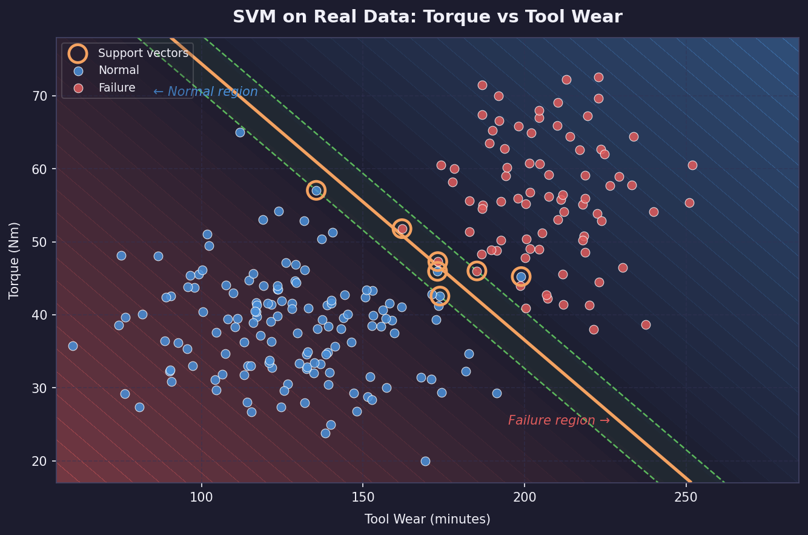


On torque and tool wear data, the boundary is chosen by the readings closest to the margin, not by every point equally.

Kernel trick: what if the data is not linearly separable in 2D? SVM can project the data into higher dimensions using a kernel function, where a linear boundary in the higher dimension corresponds to a curve in the original space. The RBF, or radial basis function, kernel is the most common choice and handles most non-linear problems well.
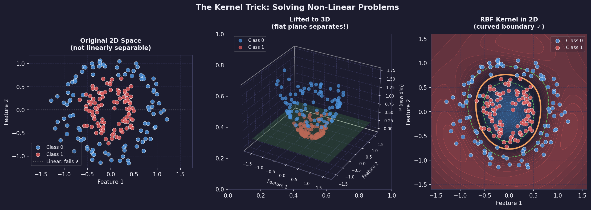


The kernel trick lets SVM solve curved decision problems without manually inventing new features.

The `C` parameter controls how strict the margin is. A small `C` allows some mistakes so the model can keep a wider, smoother margin. A large `C` punishes mistakes heavily, which can fit the training data more tightly but may generalize worse.


Increasing `C` moves SVM from a softer margin that tolerates errors toward a harder margin that tries to classify every training point correctly.

What it gives you: a boundary defined by support vectors and a margin width. This is less directly interpretable than a decision tree, but more structured than a black-box model. If the support vectors make sense, the boundary usually makes sense.
**Use when:** your dataset is small to medium sized, especially under 10,000 rows, the features are clean and scaled, and you want strong generalization with a well-understood mathematical guarantee.

**Do not use when:** your dataset is very large, because SVM training is slow on millions of rows, or you need feature importances.

---

## The ML Pipeline


---

### The ML Pipeline
Every ML project follows the same sequence of steps --- from raw data to a working predictor. This sequence is called the ML pipeline. Learning it once means you can apply it to any dataset. The next lesson walks through every step on a real engineering dataset. This lesson gives you the map first.
**Step 1: Get Data** — Data is the raw material of every ML project. In this course it comes from Kaggle, a platform hosting thousands of free labeled datasets. In industry it comes from sensors, databases, or instruments you build yourself.

**Step 2: Explore (EDA)** — Before training anything, look at your data. Check how many rows and columns exist, what data types each column has, and whether the class distribution is balanced. Functions like `df.head()`, `df.info()`, and `df.describe()` give you this picture in seconds. Skipping this step means discovering problems only after hours of wasted training.

**Step 3: Clean** — Real data has missing values, duplicate rows, and outliers. Most ML algorithms cannot handle missing values: they either crash or produce silent wrong results. Cleaning means finding and fixing these issues before training starts.

**Step 4: Feature Engineering** — Features are the columns you feed into the model. Raw columns are not always in the most useful form: a string category like `"L"`, `"M"`, or `"H"` must be converted to numbers before a model can read it. Feature engineering transforms raw data into the best possible inputs for the algorithm.

**Step 5: Split Into Train and Test Sets** — You cannot evaluate a model on the same data it trained on; that is like marking your own homework. Split the data before training so the test set stays completely unseen until the final evaluation.

```python
from sklearn.model_selection import train_test_split
import numpy as np

# Simulated dataset - 1000 examples, 5 features
X = np.random.rand(1000, 5)
y = np.random.randint(0, 2, 1000)

X_train, X_test, y_train, y_test = train_test_split(
    X, y,
    test_size=0.2,       # 20% reserved for testing
    random_state=42,     # same split every run
    stratify=y           # keep class ratio equal in both sets
)
print(f"Training rows: {len(X_train)}")
print(f"Test rows:     {len(X_test)}")
```

| Setting | Meaning |
|---------|---------|
| `test_size=0.2` | 800 rows train, 200 rows test. |
| `random_state=42` | Same split every time you run the code. |
| `stratify=y` | If 10% of `y` is class 1, both sets will be 10%. |

**Step 6: Scale Features** — Features with large numeric ranges, like RPM in the thousands, dominate features with small ranges, like temperature in the hundreds, even when the smaller feature is more predictive. `StandardScaler` removes this bias by centering every feature around zero with equal spread.

```python
from sklearn.preprocessing import StandardScaler
import numpy as np

X_train = np.array([[1500, 298.5], [1800, 302.1], [1200, 296.0]])
X_test  = np.array([[1650, 300.0]])

scaler = StandardScaler()

# Fit ONLY on training data, then transform both sets
X_train_scaled = scaler.fit_transform(X_train)
X_test_scaled  = scaler.transform(X_test)   # NOT fit_transform

print("Before:", X_train[0])
print("After: ", X_train_scaled[0].round(3))
```

!!! warning "Scaling leak"
    Always call `fit_transform` on training data and `transform`, never `fit_transform`, on test data because fitting the scaler on test data leaks information from the exam into the study guide.

**Step 7: Train Model** — Training feeds the scaled data to the algorithm and lets it adjust its internal numbers to minimize prediction error. In scikit-learn this is always one line: `model.fit(X_train, y_train)`.

**Step 8: Evaluate** — After training, run the model on the test set and compare predictions to the true labels. For classification, use precision, recall, and F1-score rather than accuracy alone because accuracy is misleading when one class is much rarer than the other. A model that predicts `"no failure"` every time achieves 96% accuracy on a dataset where only 4% of readings are failures, while catching zero real failures.

**Step 9: Tune** — Every algorithm has hyperparameters: settings you choose before training. Tuning means trying different values and keeping the combination that produces the best evaluation score.

**Step 10: Deploy / Use** — A model that stays in a notebook helps no one. Deployment means saving the trained model to a file and loading it wherever predictions are needed, whether that is a web server, a laptop on a factory floor, or a robot.
**Next step:** The next lesson applies every one of these steps to the AI4I Predictive Maintenance dataset --- real sensor readings from a CNC machine, real failure labels, and real engineering decisions.

---

## Project: Robot Arm Failure Prediction


---

!!! tip "The problem we are solving"
    A factory robot arm breaks without warning. Production stops for hours while engineers scramble to fix it --- every unplanned shutdown costs thousands of dollars. What if a model could look at sensor readings and say *"this arm is going to fail in the next few hours"* before it actually does? That is exactly what we will build.
### What you will build
By the end of this project you will have a program that reads sensor data from a robot arm and outputs a failure warning. Here is the full journey:
Raw sensor CSV → Explore & clean → Train model → Predict failures
We will build this step by step. Each cell is one small piece of that pipeline --- run them from top to bottom in Colab.
### Step 0 --- Get the data (Kaggle setup)
The dataset lives on Kaggle, a free platform that hosts machine learning datasets. You need a free account and a one-time legacy API key so that Colab can download it for you. This only takes two minutes.
1. **Go to Kaggle and sign in.** Open [kaggle.com](https://www.kaggle.com/) and sign in (or create a free account).
2. **Open Settings.** Click your profile picture in the top-right corner, then click **Settings**.
3. **Create a Legacy API Key.** Scroll down to the **API** section. Look for the **Legacy API** sub-section and click **Create New Legacy API Key**. This is important — a regular API key does not download a JSON file, and the JSON is what the Kaggle CLI needs.
4. **Open the downloaded file.** Your browser automatically downloads a file called `kaggle.json`. Open it in any text editor — it contains a short line that looks like `{"username":"…","key":"…"}`. Select and copy that entire line.
5. **Keep it ready.** You will paste that copied text into the first Colab cell. The notebook will ask for it with a password-style prompt.
!!! tip "Keep the token private"
    Your token is like a password --- it gives access to your Kaggle account. Never share a notebook that still has the token text visible.
### Open the notebook
Click the button below to open the project notebook in Google Colab. Then run the cells one by one --- each section below explains what each cell does and what you should see.
!!! tip "Dataset"
    [AI4I 2020 Predictive Maintenance Dataset](https://www.kaggle.com/datasets/stephanmatzka/predictive-maintenance-dataset-ai4i-2020) --- 10,000 rows of real robot sensor readings, each labelled Normal or Failure.
[Open in Colab →](https://colab.research.google.com/github/purwar-lab/ml-for-robotics-/blob/main/notebooks/ch3-failure-prediction.ipynb)
### Phase 1 --- Set up Colab
The first two cells connect Colab to Kaggle and download the data. You only need to run them once per session.
**Cell 1** installs the Kaggle tool and asks for your token. When the cell runs you will see a password-style box --- paste your copied token text there and press Enter.
Cell 1: Install Kaggle API & set up credentials
```python
!pip -q install kaggle
import json, os
from getpass import getpass

os.makedirs("/root/.kaggle", exist_ok=True)
token = json.loads(getpass("Paste your Kaggle API token text: ").strip())
with open("/root/.kaggle/kaggle.json", "w") as f:
    json.dump(token, f)
os.chmod("/root/.kaggle/kaggle.json", 0o600)
```
*Expected output:* A hidden text prompt. After you paste and press Enter, nothing more is printed — that means it worked.
**Cell 2** downloads the dataset zip file and unpacks it into a folder called `data/`.
Cell 2: Download the dataset from Kaggle
```python
!kaggle datasets download -d stephanmatzka/predictive-maintenance-dataset-ai4i-2020
!unzip -o predictive-maintenance-dataset-ai4i-2020.zip -d data
```
*Expected output:* Lines like `Downloading…` followed by `inflating: data/ai4i2020.csv`. One CSV file now lives under `data/`.
**Cell 3** loads all the Python libraries we need. Think of this as opening a toolbox --- we are not doing any work yet, just laying the tools on the bench.
Cell 3: Import libraries
```python
import numpy as np
import pandas as pd
import matplotlib.pyplot as plt
from sklearn.model_selection import train_test_split
from sklearn.preprocessing import StandardScaler
from sklearn.linear_model import LogisticRegression
from sklearn.ensemble import RandomForestClassifier
from sklearn.metrics import classification_report, ConfusionMatrixDisplay, f1_score
```
*Expected output:* No output at all — silence means all libraries loaded successfully.
### Phase 2 --- Meet the data
Before training any model, always look at the data first. You want to understand what columns exist, what the numbers mean, and whether anything looks unusual. Skipping this step is the most common beginner mistake.
**Cell 4** loads the CSV and prints three summaries. Read through each one --- they tell you the shape of the data before a single line of ML code runs.
Cell 4: Load and explore the data
```python
df = pd.read_csv("data/ai4i2020.csv")
display(df.head())      # first 5 rows — shows what a row looks like
df.info()               # column names and data types
display(df.describe())  # min, max, average for each number column
```
!!! tip "What to look for"
    Find the `Machine failure` column — that is what we want to predict (0 = normal, 1 = failure). The other columns — temperature, speed, torque, tool wear — are what we will use as clues.

*Expected output:* A table of rows followed by column statistics. You should see columns like `Air temperature [K]`, `Torque [Nm]`, and `Machine failure`.
**Cell 5** draws a bar chart showing how many normal rows vs failure rows the dataset contains. This is one of the most important charts in the whole project.
Cell 5: Visualize class distribution
```python
counts = df["Machine failure"].value_counts().sort_index()
counts.plot(kind="bar", color=["#34d399", "#fb7185"])
plt.xticks([0, 1], ["Normal", "Failure"], rotation=0)
plt.title("How many normal vs failure examples?")
plt.ylabel("Number of rows")
plt.show()
```
!!! warning "Why the imbalance matters"
    You will see a very tall green bar (normal) and a tiny red bar (failure). That is realistic — machines fail rarely. But it creates a trap: a model that just guesses "normal" every single time would score ~97% accuracy while being completely useless. Later cells fix this with `class_weight="balanced"`.

*Expected output:* A bar chart with roughly 9,660 normal rows and 340 failure rows.
**Cell 6** draws a correlation heatmap --- a grid that shows which columns tend to move together. Red squares mean two columns rise and fall together; blue squares mean they move in opposite directions.
Cell 6: Visualize feature correlations
```python
corr = df.select_dtypes(include="number").corr()
plt.figure(figsize=(9, 7))
plt.imshow(corr, cmap="coolwarm", vmin=-1, vmax=1)
plt.colorbar(label="Correlation (-1 to +1)")
plt.xticks(range(len(corr.columns)), corr.columns, rotation=90)
plt.yticks(range(len(corr.columns)), corr.columns)
plt.title("Which sensor readings move together?")
plt.tight_layout()
plt.show()
```
!!! tip "What to look for"
    Find the `Machine failure` row. Any column with a noticeably red or blue square there is correlated with failure — the model will find those patterns automatically.

*Expected output:* A 12×12 colour grid. Diagonal squares are always deep red (a column perfectly correlates with itself).
**Cell 7** checks for missing values. Most models crash or give wrong answers when data is missing, so we always check before doing anything else.
Cell 7: Check for missing values
```python
missing = df.isnull().sum()
print(missing[missing > 0])
print(f"\nTotal missing values: {missing.sum()}")
```
*Expected output:* `Total missing values: 0` — this dataset is already clean, so we can move straight to modelling.
### Phase 3 --- Prepare the data for training
Raw data cannot go straight into a model. We need to pick the right columns, split the data into a training set and a test set, and make sure the numbers are on a comparable scale.
**Cell 8** picks the five sensor columns we will use as inputs, and sets the failure column as the thing we want to predict.
Cell 8: Choose features and label
```python
feature_cols = [
    "Air temperature [K]",
    "Process temperature [K]",
    "Rotational speed [rpm]",
    "Torque [Nm]",
    "Tool wear [min]"
]
X = df[feature_cols]   # inputs  — the clues the model reads
y = df["Machine failure"]  # output — what we want to predict
print(X.shape, y.shape)
```
!!! tip "X and y — the core pattern"
    Every supervised learning project follows this same shape. `X` is the table of clues (inputs). `y` is the column of answers (labels). The model learns the mapping from `X` to `y`.

*Expected output:* `(10000, 5) (10000,)` — 10,000 rows, 5 input columns, 10,000 labels.
**Cell 9** splits the data into a training set (80%) and a test set (20%). The model only ever sees the training set while learning. The test set is kept hidden until the final evaluation --- like a sealed exam paper.
10,000 rows full dataset → 8,000 rows training set + 2,000 rows test set
Cell 9: Train / test split
```python
X_train, X_test, y_train, y_test = train_test_split(
    X, y, test_size=0.2, random_state=42, stratify=y
)
print(f"Training rows: {X_train.shape[0]}")
print(f"Test rows:     {X_test.shape[0]}")
```
*Expected output:* `Training rows: 8000, Test rows: 2000`. (`stratify=y` keeps the same ~3.4% failure rate in both halves.)
**Cell 10** scales the numbers so they are all on a similar range. Without this, a column measured in Kelvin (≈300) would drown out a column measured in minutes (≈0--240) purely because its numbers are bigger.
!!! warning "The golden rule of scaling"
    We fit the scaler *only on training data*, then apply the same scaler to the test data. Why? The test set is the final exam --- if the scaler peeks at test data to calculate averages, the model gets an unfair preview and will appear better than it really is.
Cell 10: Scale features
```python
scaler = StandardScaler()
X_train_scaled = scaler.fit_transform(X_train)  # learn + apply
X_test_scaled  = scaler.transform(X_test)        # apply only
```
*Expected output:* No printed output — the scaled arrays are ready in memory.
### Phase 4 --- Train two models and compare them
We will train two different models on the same data and see which one is better at predicting failures. Think of it like testing two different doctors on the same set of patient records --- you want to know who gives the more accurate diagnosis.
**Cell 11** trains the first model: Logistic Regression. It is the simplest possible approach --- a good baseline to beat.
Cell 11: Train Logistic Regression
```python
log_reg = LogisticRegression(max_iter=1000, class_weight="balanced")
log_reg.fit(X_train_scaled, y_train)
log_pred = log_reg.predict(X_test_scaled)
print("Logistic Regression trained.")
```
!!! tip "What is class_weight=\"balanced\"?"
    Remember the imbalanced bar chart? `class_weight="balanced"` tells the model to treat a missed failure as more costly than a false alarm — otherwise it would just predict "normal" for everything and look accurate.

*Expected output:* `Logistic Regression trained.`
**Cell 12** evaluates that model and draws a confusion matrix --- a 2×2 grid that shows exactly which types of mistakes it made.
|  | **Predicted Normal** | **Predicted Failure** |
|--|--|--|
| **Was actually Normal** | True Negative ✓ | False Positive ✗ |
| **Was actually a Failure** | False Negative ✗ *(the dangerous mistake)* | True Positive ✓ |
Cell 12: Evaluate Logistic Regression
```python
print(classification_report(y_test, log_pred))
ConfusionMatrixDisplay.from_predictions(
    y_test, log_pred, display_labels=["Normal", "Failure"]
)
plt.title("Logistic Regression — what mistakes did it make?")
plt.show()
```
!!! tip "Reading the report"
    Look at the **Failure** row in the classification report. *Recall* tells you what fraction of real failures the model caught. A low recall means many failures slipped through undetected — that would be costly in a real factory.

*Expected output:* A text table of precision/recall/F1 scores, then a 2×2 colour grid (the confusion matrix).
**Cell 13** trains the second model: a Random Forest. Instead of one straight decision line, it builds 100 decision trees and takes a vote --- usually more accurate on sensor data like this.
Cell 13: Train Random Forest
```python
forest = RandomForestClassifier(
    n_estimators=100,   # 100 trees vote on each prediction
    random_state=42,
    class_weight="balanced"
)
forest.fit(X_train, y_train)   # no scaling needed for forests
forest_pred = forest.predict(X_test)
print("Random Forest trained.")
```
!!! tip "Why no scaling here?"
    Random forests split data by asking questions like "is torque > 40?" The threshold is always relative, so the scale of the numbers does not matter. Logistic Regression, by contrast, adds numbers together — so scale matters a lot.

*Expected output:* `Random Forest trained.` (may take 5–10 seconds)
**Cell 14** puts both models side by side using a single number --- the F1 score --- so you can directly compare them.
!!! tip "Why F1 and not accuracy?"
    Accuracy counts all correct predictions equally. F1 specifically rewards catching real failures and penalises missing them. For rare events like equipment failures, F1 is the honest measure.
Cell 14: Compare both models
```python
log_f1    = f1_score(y_test, log_pred)
forest_f1 = f1_score(y_test, forest_pred)

print(f"Logistic Regression F1: {log_f1:.3f}")
print(f"Random Forest F1:       {forest_f1:.3f}")

winner = "Random Forest" if forest_f1 > log_f1 else "Logistic Regression"
print(f"\nWinner: {winner}")
```
*Expected output:* Two F1 scores and a winner line. Random Forest typically wins on this dataset — but by how much?
### Phase 5 --- Challenge: does more trees mean better?
The Random Forest used 100 trees. What if we tried 10? Or 200? Cell 15 runs the model five times with different tree counts and plots the result. Your job is to look at the chart and decide: at what point do extra trees stop helping?
Cell 15: Challenge — tune n_estimators
```python
tree_counts = [10, 25, 50, 100, 200]
scores = []

for n in tree_counts:
    model = RandomForestClassifier(
        n_estimators=n, random_state=42, class_weight="balanced"
    )
    model.fit(X_train, y_train)
    scores.append(f1_score(y_test, model.predict(X_test)))

plt.plot(tree_counts, scores, marker="o", color="#6366f1", linewidth=2)
plt.xlabel("Number of trees")
plt.ylabel("F1 score (higher = better)")
plt.title("Does adding more trees keep improving the model?")
plt.grid(True, alpha=0.3)
plt.show()

best_n = tree_counts[scores.index(max(scores))]
print(f"Best result: {max(scores):.3f} F1 with {best_n} trees")
```
!!! tip "What to look for"
    The line usually rises sharply from 10 → 50 trees and then flattens. That flat part is the "diminishing returns" zone — extra computation, no extra accuracy. This pattern appears in almost every real ML project.

*Expected output:* A line plot and a printed best score. Compare it against the 100-tree score from Cell 14.

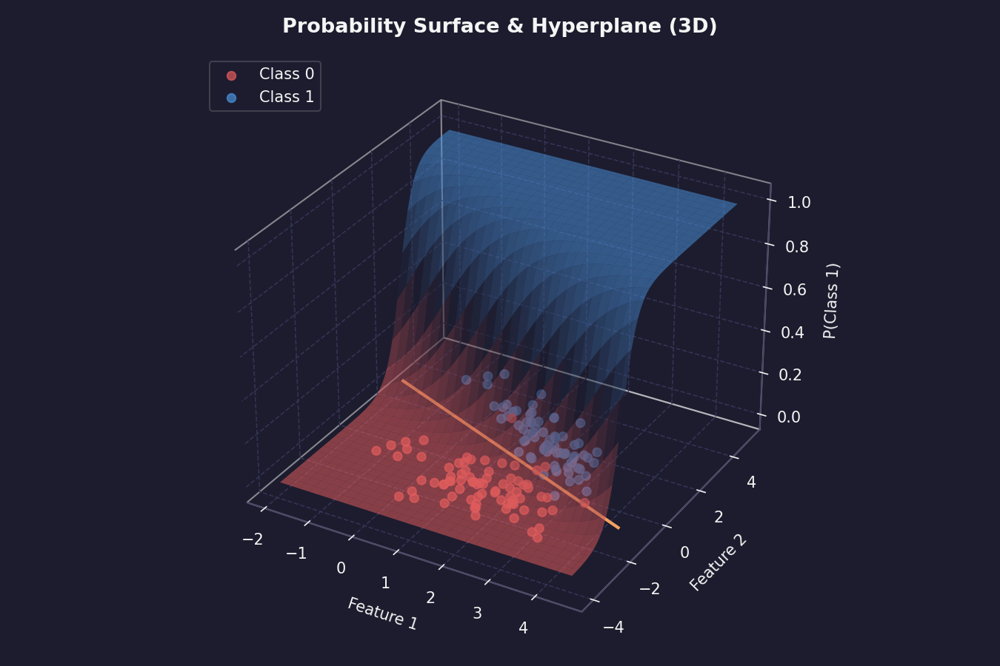

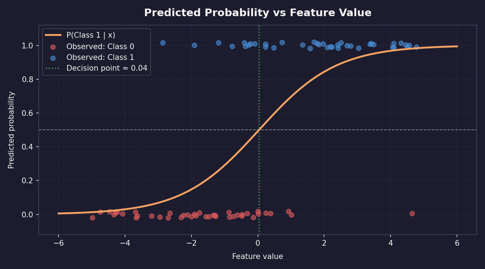

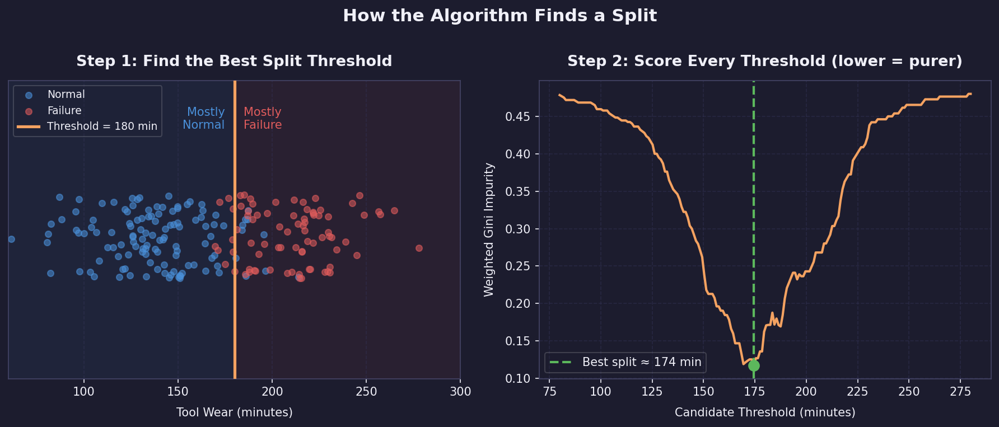

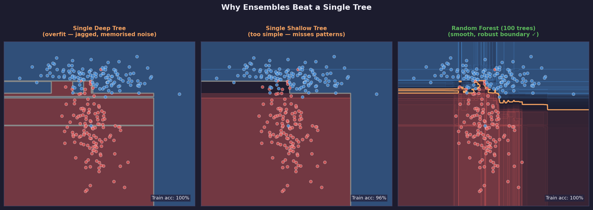

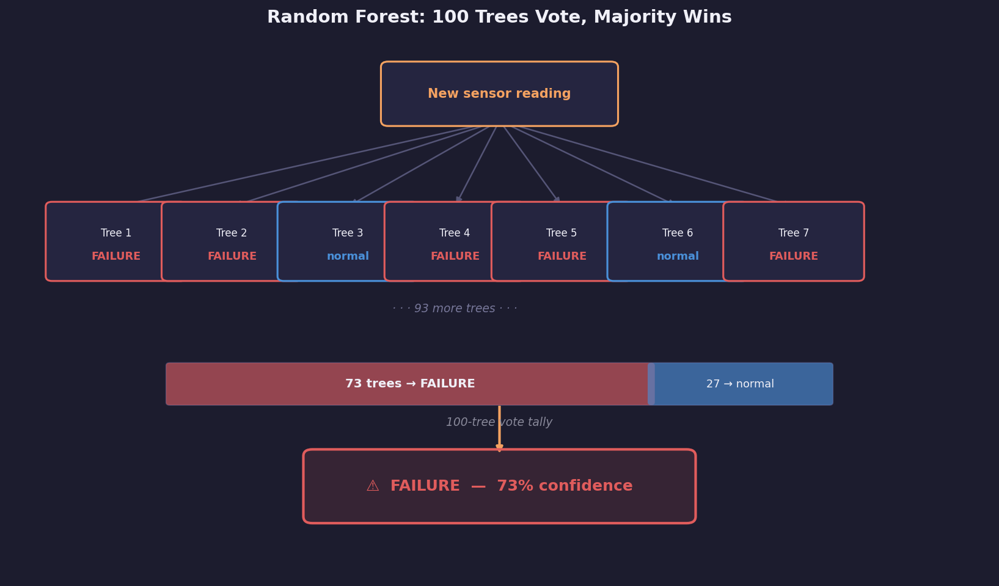

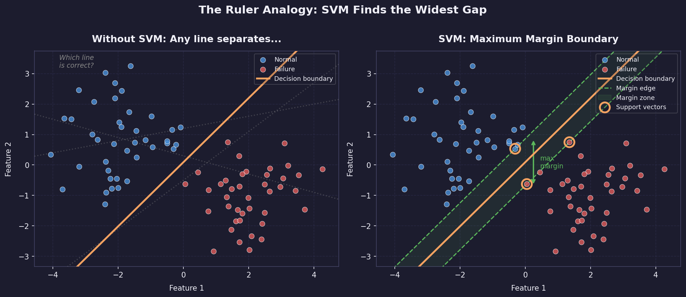

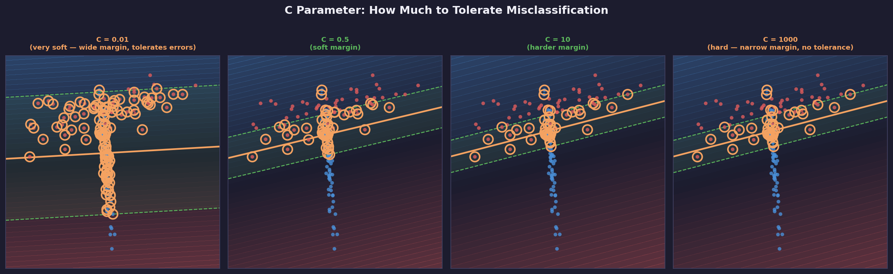
