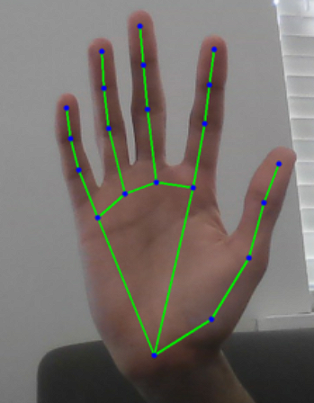
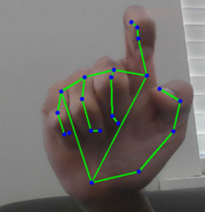

# * Project 3: Gesture Controlled Robot

---

## What Is MediaPipe?

<video controls width="100%"><source src="/original/hand_gesture.mp4" type="video/mp4"></video>

---

In Project 1 you trained your own YOLO model from scratch: 150 images, Roboflow labels, 15 minutes of Colab training. That gave you a model that detects exactly what you chose. In Project 2 you used no model at all, just pixel math. In Project 3 you use a third approach: a pre-trained model built by Google for one specific task --- controlling a robot with nothing but your hands.
MediaPipe reads your hand landmarks in real time and translates
    gestures into robot commands over WiFi --- no model training required.
MediaPipe is a collection of ready-made ML pipelines for common computer vision tasks. Hand tracking, face detection, pose estimation, object detection: all available as Python imports with no training required. You do not collect data, you do not train, you do not export weights. You install the library and call three lines of code.
Approach Project 1 YOLO Project 2 Classical Project 3 MediaPipe Model You trained it No model Google pre-trained What it detects Your custom object Bright/dark contrast Human hands, always Setup time Exercise A, about 1 hour Zero pip install plus 3 lines Flexibility Anything you label Controlled scenes Hands only Speed on CPU 15-30 fps 60+ fps 25-30 fps
!!! tip "Task-specific pre-trained model"
    MediaPipe's hand tracking runs on phones in real time. It powers features in Google Meet, YouTube, and Android camera apps. When you install it and call it in Python, you are using the same kind of optimized model that runs on millions of devices daily. Someone spent months building and optimizing it so you do not have to.

### Robot Gesture Map
Gesture Command Both hands open FORWARD Both hands closed BACKWARD Right open, left closed TURN RIGHT Left open, right closed TURN LEFT One hand or no hands STOP
!!! info "Prerequisites"
    Complete Exercise B so the phone stream works, complete Exercise D so UDP motor commands work, and keep `shared.py` in the project folder from Projects 1 and 2. The Arduino still runs the same `robot_udp` sketch from Exercise D. There is no new Arduino code.

---

## How Hand Landmark Detection Works

---

MediaPipe does not just detect that a hand is present. It detects 21 specific points on the hand called landmarks. Each landmark has an x, y, and z coordinate normalized to the image size.


MediaPipe hand landmark indices used for gesture detection.
Index Meaning 0 wrist, reference point for thumb detection 2, 3, 4 thumb MCP, thumb IP, thumb tip 6, 8 index PIP and tip 10, 12 middle PIP and tip 14, 16 ring PIP and tip 18, 20 pinky PIP and tip
The core insight: if a finger tip is above its PIP joint, it has a lower y value because y increases downward. That finger is extended. If the tip is below the PIP joint, the finger is curled.


Extended finger tip.y < pip.y Curled finger tip.y > pip.y
!!! info "Normalized coordinates"
    The coordinates are normalized: x and y are between 0 and 1, where (0,0) is the top-left of the image and (1,1) is the bottom-right. This means the detection works regardless of image resolution. A hand at x=0.5 is always in the horizontal center of the frame.

---

## The MediaPipe Colab Notebook


---

Learn MediaPipe on a laptop image in Colab before touching the robot. You will see landmarks drawn on your own hand, inspect the coordinate system, and test the open/closed classification before wiring it to UDP motor commands.
[Open in Colab →](https://colab.research.google.com/github/purwar-lab/ml-for-robotics-/blob/main/notebooks/proj3-gesture-recognition.ipynb)
!!! info "Why download a .task file?"
    The new MediaPipe Tasks API separates the Python library from the model weights. The library, installed with `pip install mediapipe`, gives you the inference engine. The `.task` file contains the trained hand landmark model weights, about 8 MB, downloaded from Google's servers. This separation means Google can update the model independently of the library. The `wget` command in Cell 1 downloads the model once to your Colab session. In VS Code, the download script in the setup lesson saves it permanently to your project folder.
Install MediaPipe and download the model
```

```
!!! info "Why two steps to load the model?"
    Cell 1 downloads the model weights file, about 8MB, from Google's servers and saves it as `hand_landmarker.task` in the Colab session's local storage. Cell 2 loads that file into memory and initializes the detector. Both cells are required. The `-q` flag in `wget` makes the download silent; it gives no output even when it succeeds. The verification print above confirms it worked. If the file size shows as 0 MB or the file is missing, your internet connection blocked the download. Try re-running Cell 1.
Initialize the HandLandmarker
```

```
Parameter Meaning running_mode=RunningMode.IMAGE For still images. Detection is synchronous and blocks until complete. Used in the Colab notebook. running_mode=RunningMode.VIDEO For video frames with timestamps. Detection is synchronous per frame. Used in gesture_recognize.py and gesture_control.py . running_mode=RunningMode.LIVE_STREAM Asynchronous mode. It returns immediately and calls a callback when the result is ready. Not used in this course. num_hands=2 Maximum number of hands to detect. This replaces max_num_hands from the old API. min_hand_detection_confidence=0.7 Only report a hand detection if the palm detector is at least 70% confident. min_hand_presence_confidence New in the Tasks API. Once a hand is tracked, it must maintain this confidence level to keep being tracked between frames.

### Cell 3: Test on a Still Image
Upload a photo of your own hand to Colab. Use the Files panel upload button or the upload prompt in this cell.
Upload and process a hand photo
```

```
The Tasks API returns `result.hand_landmarks`, a list of hands, and `result.handedness`, a matching list of left/right labels. Each hand is already a direct list of 21 normalized landmarks.

### Cell 4: Read Specific Landmarks
Inspect wrist, tip, and PIP coordinates
```

```
This is the exact comparison used by the gesture detector. `tip.y < pip.y` means the tip is higher in the image, which means the finger is extended.

### Cell 5: The is_hand_open Function
Classify one hand as open or closed
```

```
Code Meaning pts = hand_landmarks Shorthand for the direct list of 21 landmark objects returned by the Tasks API. pts[4].x > pts[2].x Thumb detection uses x-axis because the thumb extends sideways. This is an approximation for a right hand held palm-forward; the local webcam test has a more robust check. zip([8,12,16,20], [6,10,14,18]) Pairs each finger tip with its PIP joint. count >= 3 Open means at least 3 of 5 digits are extended.

### Cell 6: Two-Hand Gesture Classification
Two-hand command logic
```

```
Left hand Right hand Command OPEN OPEN FORWARD CLOSED CLOSED BACKWARD CLOSED OPEN TURN RIGHT OPEN CLOSED TURN LEFT One hand --- STOP
!!! warning "Why require both hands?"
    If only one hand is required, any accidental hand entering the frame triggers a command. Requiring both hands creates a deliberate activation gesture. The robot only moves when you consciously hold both hands up.
!!! info "Live webcam test runs in VS Code, not Colab"
    The `gesture_recognize.py` file in the repository runs live gesture detection on your laptop webcam with `RunningMode.VIDEO` and `detect_for_video()`. This file is designed to run in VS Code, not Colab. The Colab notebook teaches the concepts on still images. The live test runs locally.

---

## Understanding Landmarks


---

The gesture code uses only a subset of the 21 landmarks: the wrist, the thumb chain, and the PIP/tip pairs for the four fingers.
01234
5678
9101112
13141516
17181920
!!! info "MediaPipe also returns depth"
    MediaPipe also returns a z coordinate for each landmark. Negative z means the landmark is in front of the wrist, toward the camera. This project does not use z, but depth information could detect distance from the camera or more nuanced gestures like a pointing finger aimed toward the robot.

---

## Open vs Closed: Reading Finger State


---

The robot needs one Boolean per hand: open or closed. The method below counts extended digits and returns open when at least three are extended.
HandGestureDetector._is_open()
```

```

### Try the Rule in the Browser
Modify the y values to simulate a closed fist and verify the function returns `False`.
Open hand simulation
```

```

---

## Two-Hand Gesture Logic


---

The detector stores each hand by label, checks whether it is open, then chooses a command only when both hands are present.
Complete detect() method
```

```
Line What it does mp.Image(...) Wraps the RGB NumPy frame in the image object expected by the Tasks API. detect_for_video(..., timestamp) Runs HandLandmarker in video mode. Video mode requires a monotonically increasing timestamp for each frame. result.hand_landmarks List of detected hands. Each hand is a direct list of 21 normalized landmark objects. result.handedness List of left/right handedness classifications aligned with result.hand_landmarks by index. hands_dict[label] = {"open": open_state} Stores each hand by name so the command logic can read hands_dict["Left"]["open"] and hands_dict["Right"]["open"] . draw_hand_landmarks(...) Uses a small OpenCV helper to draw hand connections and landmark dots directly from the Tasks API landmark list.
!!! warning "Mirror note for phone camera"
    MediaPipe labels hands from the model's perspective, not always the user's. `gesture_recognize.py` flips the webcam frame for a mirror effect with `frame = cv2.flip(frame, 1)`. `gesture_control.py` does not flip the phone stream because the phone camera is not being used as a mirror. Test which labeling your setup produces and swap `Left` and `Right` in the gesture block if needed.
!!! warning "Troubleshooting inverted commands"
    If forward and backward are swapped, or left and right are inverted, the handedness labels are mirrored for your camera setup. In `gesture_control.py`, find the gesture classification block and swap `Left` and `Right` everywhere in that section.

---

## Get the Robot Code

[Download](original/shared.py)

[Download](original/gesture_control.py)

---

The robot version uses the same phone stream and UDP command infrastructure from earlier projects. Only the vision module changes.
shared.pyAlready have this from Projects 1 and 2. No download needed if it is already in your `my-detector` folder.`shared.py`
gesture_control.pyThe robot control script. Place it in the same folder as `shared.py`.`gesture_control.py`
!!! info "Local test file is separate"
    `gesture_recognize.py` runs on a laptop webcam with `cv2.VideoCapture(0)`. It does not import `shared.py` because it has no robot connection. Use it to test gestures before running `gesture_control.py`.

### One-Time Model Download
Run this once in VS Code from the same folder as `gesture_recognize.py` and `gesture_control.py`. Both files need `hand_landmarker.task` in that folder.
Download hand_landmarker.task
```

```
This is the complete robot control file for reference. Come back to this as each lesson explains one section.
Complete robot control file
```

```

---

## What Changes from Projects 1 and 2


---

Project 1 Project 2 Project 3 Vision module Tracker (YOLO) LaneFollower (OpenCV threshold) HandGestureDetector (MediaPipe) Input to control bbox cx, area near_cx, far_cx command string Control type PID, continuous PID, continuous Direct lookup New import ultralytics OpenCV pipeline mediapipe Tasks API plus hand_landmarker.task Shared infra shared.py shared.py shared.py Arduino sketch robot_udp robot_udp robot_udp

### Three Things Are New
1. `mediapipe` Tasks imports and `HandLandmarker` initialization
2. `HandGestureDetector` class
3. Direct speed lookup instead of PID
Everything else is shared infrastructure from Exercise D.
!!! warning "The biggest conceptual change: no PID"
    Projects 1 and 2 used PID controllers that continuously adjusted motor speed based on a numeric error signal. Project 3 does not. There is no error. The gesture maps directly to a speed pair. Both hands open means `left = BASE_SPEED` and `right = BASE_SPEED`. Done.
    This is open-loop gesture control. It is simpler and more predictable for discrete commands like go, stop, and turn. The robot does not know where it is or how far it has traveled. It just executes the commanded gesture until the gesture changes.

---

## The HandGestureDetector Class


---

This class is the only new controller in Project 3. It initializes MediaPipe, reads each hand, classifies the two-hand gesture, and maps that gesture to motor speeds.
Complete HandGestureDetector class
```

```

### Method 1: `__init__`
__init__
```

```
`HandLandmarkerOptions` loads `hand_landmarker.task` and selects `RunningMode.VIDEO`, which requires a timestamp for each camera frame. The drawing helper is pure OpenCV: it converts normalized landmark coordinates into pixel positions, then draws lines and dots on the frame.

### Method 2: `_is_open`
_is_open
```

```
Identical to the `is_hand_open` function from Colab Cell 5. You already understand this.

### Method 3: `_gesture_to_speeds`
_gesture_to_speeds
```

```
Command Speeds Meaning forward BASE_SPEED, BASE_SPEED both wheels forward backward -BASE_SPEED, -BASE_SPEED both wheels backward left 0, TURN_SPEED only right wheel drives right TURN_SPEED, 0 only left wheel drives stop 0, 0 no movement
Using one wheel stationary and one wheel driving creates a pivot turn. It is more responsive than differential steering for coarse gesture control, where the user wants an immediate direction change. The tradeoff is that the turn is less smooth.

### Method 4: `detect`
detect
```

```
The Colab concepts appear directly in this method: convert the frame to RGB, wrap it in `mp.Image`, call `detect_for_video()`, read `result.hand_landmarks` and `result.handedness`, then pass each hand list into `self._is_open(...)`.

---

## The Main Loop


---

The loop follows the same architecture as Projects 1 and 2: read frame, compute motor speeds, send UDP command, draw a HUD, repeat.
Complete main() function
```

```
Line What changed from Projects 1 and 2 detector = HandGestureDetector() Replaces tracker = Tracker() and follower = LaneFollower() . Same pattern: one controller object initialized before the loop. left_speed, right_speed, cmd_name, debug = detector.detect(frame) Replaces tracker.control(frame) and follower.control(frame) . cmd_name is a new string used for the HUD and terminal print. speed_changed = ... Sends a command when speed changes significantly or when the keep-alive interval has elapsed. cmd_interval = 0.08 Resends motor commands every 80ms, safely below the Arduino's 500ms command timeout. Projects 1 and 2 used 30ms because PID produces a new output every frame; here the gesture can stay unchanged for seconds, so the keep-alive is essential. commander.motors(left_speed, right_speed) No negative sign on left_speed . If the robot spins instead of going forward, use commander.motors(-left_speed, right_speed) . detector.close() MediaPipe cleanup releases the underlying model resources.

---

## Running and Testing


---

### Install MediaPipe and the HandLandmarker model
Run the Python download snippet once from the same folder as `gesture_recognize.py` and `gesture_control.py`. Both scripts expect `hand_landmarker.task` beside them.

### Step 1: Test Gesture Recognition Locally First
Before connecting to the robot, run `gesture_recognize.py` on your laptop webcam.
Local webcam test
```

```
Test Expected display Hold both hands open FORWARD Make both fists BACK Right open, left fist RIGHT Left open, right fist LEFT Drop one hand STOP

### Step 2: Fill in Configuration
In `gesture_control.py`, update `ESP_IP` with your Arduino IP from Exercise D and `MOBILE_IP` with your phone IP from Exercise B.

### Step 3: Run with Robot
Robot control
```

```
The terminal prints each command as it is sent:
Example output
```

```

### Common Issues
Issue Fix Gestures not detected Check lighting and background. Lower min_hand_detection_confidence to 0.5 if hands are frequently missed. Robot moves when only one hand is visible Check that num_hands=2 and the logic requires both Left and Right in the hands dict. LEFT and RIGHT are swapped Use the mirror note from P3.5 and swap Left and Right labels in the gesture block. Robot does not respond at all Run robot_keyboard.py from Exercise D to confirm UDP still works.

### Final Checklist
gesture_recognize.py runs on laptop webcam without errors All five gestures classify correctly in the local test mediapipe is installed in the venv hand_landmarker.task is downloaded in the project folder ESP_IP and MOBILE_IP are updated in gesture_control.py robot_keyboard.py from Exercise D confirmed still working Robot responds to FORWARD gesture and drives forward Robot stops when one hand is lowered

---

## Connecting the Dots


---

You have now built three robot vision behaviors on the same foundation.
Project Vision Control Project 1 Neural network finds an object PID steers toward it Project 2 Pixel math finds a line PID follows it Project 3 Neural network reads your hand Direct command to motors
All three use the same infrastructure. All three communicate over UDP. All three use the same Arduino sketch. The vision module and control logic swapped three times. The foundation never changed.

### The Three Approaches to Vision
Trained custom modelFlexible, works on any object you train for, requires data collection.**Use when:** the thing you want to detect does not have a ready-made detector.
Classical image processingFast, no model needed, brittle to lighting changes.**Use when:** the visual target is simple and the environment is controlled.
Pre-trained task-specific modelZero training required, very accurate for the specific task, cannot be used outside its design.**Use when:** your task matches one that already has a production model.
!!! tip "The architecture is the point"
    The pipeline you built, phone camera to laptop vision to UDP commands to Arduino to motors, is architecturally identical to how commercial mobile robots receive instructions. In a production robot each part would be dedicated hardware, but the data flow is the same.



