#  Exercise A: Train Your First Detector

---

## What is Object Detection?


---

Object detection is the bridge between computer vision and robot action. Instead of only asking what is in an image, the detector tells the robot where the target is, how confident the model is, and how large the object appears in the frame.
Given an image, output one label. Is this a cat or a dog? The model looks at the whole image and gives one answer.
Given an image, find every instance of target objects and draw a box around each one. Output: a list of boxes, each with a class name and a confidence score. This is what YOLO does.
Like detection but instead of a box, draw the exact pixel outline of each object. More precise, much slower.
!!! tip "Why detection is right for tracking"
    For robot tracking, detection is the right choice. You need to know where the object is, using the bounding box center, and how big it appears, using box area as a proxy for distance. Classification alone cannot give you position. Segmentation is overkill and too slow for real-time control.

### What A Bounding Box Actually Is
Every detection is a rectangle described by four numbers. You will see two formats often: corner coordinates for inference and normalized center coordinates for training labels.
target object (120, 45) (380, 290) center: (0.50, 0.30) xyxy: corner format [x_top_left, y_top_left, x_bottom_right, y_bottom_right] Example: [120, 45, 380, 290] . Project 1 uses this format when reading YOLO output. xywh: center format [x_center, y_center, width, height] , normalized from 0 to 1. Example: [0.5, 0.3, 0.18, 0.24] . YOLO training labels use this format.

### What A Confidence Score Is
YOLO proposes many candidate boxes. Each box gets a confidence score from 0 to 1, meaning how sure the model is that the box contains the target object. Boxes below the threshold are discarded.
0.0 many false positives 0.5-0.6 sweet spot 1.0 only obvious detections

---

## Introducing YOLO26


---

YOLO stands for You Only Look Once. It processes the whole image in a single forward pass through the neural network and produces all detections at once, which is why it is fast enough for real-time robotics.
Before YOLO-style detectors, many systems scanned an image with repeated sliding windows. That was accurate enough for some tasks but too slow for a robot that must react while moving. YOLO trades that repeated scanning for one direct prediction pass.

### The YOLO Family
YOLO has moved through many generations: v1 through v8, then v9, v10, v11, and now YOLO26. Each generation improved the speed and accuracy tradeoff. In this course we use YOLO26 because it is the latest generation, and within it we use the nano variant (`yolo26n`) because the nano model is aimed at edge and low-power devices, which is the same constraint robots usually face.
Reference for the model family: [Ultralytics YOLO26 documentation](https://docs.ultralytics.com/models/yolo26/).
Model Size Speed (CPU) Good for yolo26n 3.5 MB Very fast This course ✓ yolo26s 11 MB Fast When nano isn't accurate enough yolo26m 30 MB Medium Good GPU available yolo26l 59 MB Slow on CPU Server/cloud deployment
!!! tip "Nano is enough for the first detector"
    For a simple task like detecting one object type against a clear background, such as a ball, mug, or cone, nano is genuinely enough. The limitation of a small model is usually crowded, complex scenes. Your first robot-tracking use case is intentionally simpler than that.

### What End-To-End Means
Older YOLO versions needed a post-processing step called Non-Maximum Suppression to remove duplicate boxes. YOLO26 is designed to produce one clean prediction per object directly. In practice that means slightly faster inference, simpler code, and easier deployment on hardware with limited post-processing support.
!!! tip "Efficient enough for edge"
    YOLO26's efficiency gains - faster CPU inference, NMS-free end-to-end prediction, and export to formats like TFLite and OpenVINO - make it practical on edge hardware: single-board computers, embedded Linux boards, and low-power laptops of the kind used around real robots. Learning it here transfers directly to deploying ML on physical hardware later.

---

## Setting Up VS Code & Dependencies


---

!!! tip "Already set up VS Code from Project 1?"
    If you already completed P1.1 and P1.2, you can skip the VS Code setup and jump to PA.3. This exercise comes first in the course order, so the full setup is included here.
Install VS Code. Go to code.visualstudio.com and install the free editor for Windows, macOS, or Linux. Install Python. Go to https://www.python.org/downloads/ and install Python. Use Python 3.10 or 3.11 for the smoothest package compatibility. On Windows, tick Add Python to PATH . Install the Python extension. Open VS Code, click Extensions, search for Python , and install the Microsoft extension. With Python already installed, the extension will detect your interpreter right away. Create a folder. Make a new folder called my-detector . Keep it separate from the later object-tracker folder.
!!! warning "Windows PATH warning"
    If you skip **Add Python to PATH,** commands like `python --version` can fail with `python is not recognized`. Re-run the Python installer and tick that box.

### pip and Virtual Environments
`pip` is Python's package manager. It downloads and installs libraries from the internet. A virtual environment is an isolated copy of Python just for this exercise, so packages installed here do not affect other Python projects on your machine.
Open the VS Code terminal in your `my-detector` folder and run these commands. After activation, the terminal prompt should start with `(venv)`.
Terminal setup commands
```bash
python --version
python -m venv venv
venv\Scripts\activate      # Windows
# If you get an error related to permissions while running above command, then
# please run this first in VS Code Powershell: Set-ExecutionPolicy -ExecutionPolicy RemoteSigned -Scope CurrentUser
source venv/bin/activate    # macOS / Linux
python -m pip install ultralytics roboflow opencv-python
```
Package Role in this exercise ultralytics Loads YOLO26, runs training, runs inference roboflow Downloads your labeled dataset from Roboflow in the right format opencv-python Opens your webcam and displays the detection results

### Verify Installation
Create `test_setup.py`, type this code, and run `python test_setup.py`. If **All good!** prints, the environment is ready.
test_setup.pyRun locally
```python
from ultralytics import YOLO
import cv2
import roboflow

print("All good!")
```

### Download YOLO26n Weights
Create `download_model.py` and run it once. Ultralytics downloads `yolo26n.pt` automatically on the first run.
download_model.pyRun locally
```python
from ultralytics import YOLO

model = YOLO("yolo26n.pt")  # downloads automatically on first run
print(f"Model loaded. Parameters: {sum(p.numel() for p in model.model.parameters()):,}")
```
A parameter is one learned number inside the neural network. YOLO26n already learned millions of these numbers during its original training, and fine-tuning adjusts them toward your target object.
!!! info "What is COCO?"
    YOLO26n comes pre-trained on COCO, a dataset of 118,000 images covering 80 common object categories. We fine-tune this pre-trained model on your custom data. Fine-tuning keeps most of what the model already learned and adapts the last layers to your object, which is why you only need about 100-150 images instead of 100,000.

---

## Creating Your Roboflow Project and Uploading Images


---

Roboflow is a web platform that handles the three hardest parts of building a custom vision model: organizing your image data, drawing and managing labels, and exporting the dataset in the exact folder structure and file format your training code expects. You do not write any code in this lesson. Everything happens in a browser.
!!! info "Why not just use a folder of images?"
    YOLO training expects a very specific folder structure: a train folder, a valid folder, a test folder, each containing an images subfolder and a labels subfolder, plus a `data.yaml` file listing your class names. Getting this right manually is tedious and error-prone. Roboflow builds that entire structure automatically and also gives you augmentation, version control, and a three-line download snippet that works directly in your Colab notebook.

### Step 1 --- Create a free Roboflow account
Go to [roboflow.com](https://roboflow.com/). Click **Get Started** in the top right corner.
Sign up with your Google account or an email address. Roboflow is free for public projects. You do not need to enter a credit card.
After signing up you will be asked to choose between two plans.
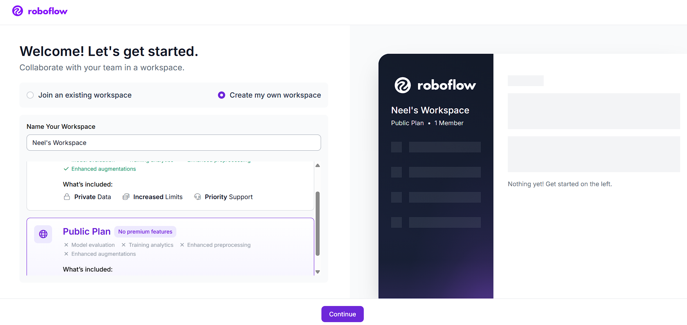

Choose the Public Plan to keep the project free.
Choose the **Public Plan** by clicking **Continue with Public**. The public plan is completely free and has everything needed for this course. The only difference from the paid plan is your dataset will be publicly visible on Roboflow Universe, which is fine for a learning project.

### Step 2 --- Skip the "What do you want to do with Roboflow" (or, choose the first two options) and skip Invite "Collaboartor" screen
Roboflow will ask if you want to invite collaborators to your workspace. You are working alone. Click **Skip** or continue without adding anyone.

### Step 3 --- Create a new project (If you don't see this option, click on Roboflow icon to go to your portal)
You will land on a screen asking you to create a project.
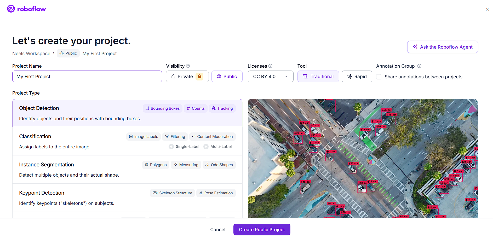

Create a public Object Detection project and enter your class label.
Project Name: use a name describing what you are detecting. Examples: tennis-ball-detector , orange-cone-tracker , red-mug-detector . Use lowercase and hyphens, no spaces. Project Type: leave this as the default Object Detection . Do not change it. Object detection is what YOLO does: it finds objects and draws boxes around them with their coordinates. Click Create Public Project to continue. Step 4 — Choose the Traditional Model Builder If you do not see this section then skip this. After creating the project Roboflow shows two options. Choose Use Traditional Model Builder Instead . Roboflow Rapid is a newer prompt-based tool that skips manual labeling. It is convenient but it is a black box: you would not learn what is actually happening. The Traditional Model Builder shows every step, which is what this course requires. Step 5 — The upload screen You should now see the main upload page with a drag-and-drop zone.
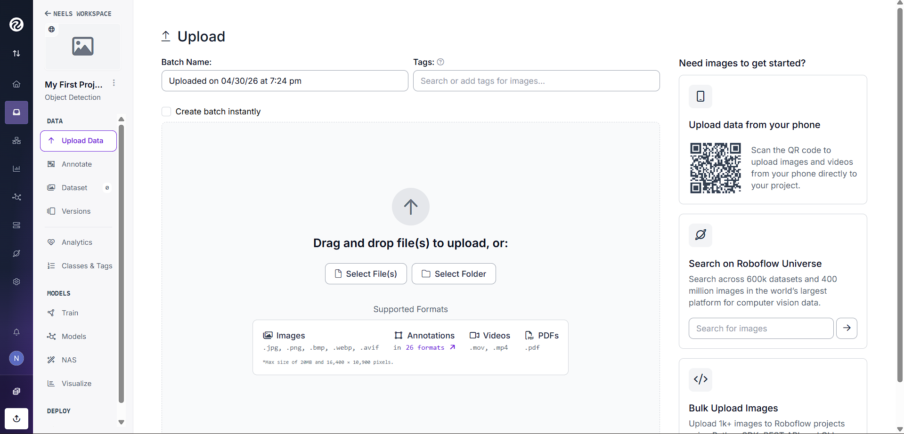
 The upload screen is where images, videos, and folders are added. This is where your images go. Keep this tab open in your browser and proceed to collect images in the next step. Step 6 — Collecting your images before uploading Before uploading anything you need images. Here is exactly how to collect good ones. What object to use Best choices A tennis ball, orange ball, any brightly colored ball, a colored traffic cone or marker, or a specific mug, bottle, or toy you own. Avoid first Your hand or face, multiple similar-looking objects, or anything that changes shape dramatically like cloth or paper. ⚙ Why a ball works well A ball is the classic choice for a reason. It looks roughly the same from every angle because it is spherical. A distinctive color separates it from most backgrounds. These two properties mean the model learns faster and needs fewer images than a complex multi-sided object. How many images to capture Target 150 images minimum . 200 to 300 gives noticeably better results. This sounds like a lot but it takes about 10 minutes with a phone. How to capture them Distances: take shots from 0.3m away, 1m away, 2m away, and 3m away. The tracker needs to work at all these distances. Angles: straight on, from the left, from the right, from above, and from slightly below. Objects look different from different angles. Backgrounds: use at least 4 different locations: kitchen floor, carpet, concrete, grass, table. This is the most important variation. Lighting: bright room with windows, dimmer room, artificial light, and slight shadow across the object. Real robots work in varied lighting. Partial views: place the object half behind another object in some shots. The model needs to recognize the object even when partially blocked. ⚠ Vary your backgrounds deliberately The single biggest beginner mistake is collecting all images in one location with one background color. The model will learn the background pattern instead of the object. It will detect perfectly in that room and fail completely everywhere else. Vary your backgrounds deliberately even if it feels unnecessary. Use your web camera. Take photos manually or record a short video and extract frames. Roboflow accepts both. For video extraction: record a 30-second video walking around the object from different angles and distances. Roboflow will extract one frame per second automatically, giving you 30 images from one recording. Do this in 5 different locations for 150 images total. Step 7 — Upload your images to Roboflow Return to the Roboflow upload tab in your browser. Drag and drop your image files or your video files directly into the upload area. You can upload everything at once.
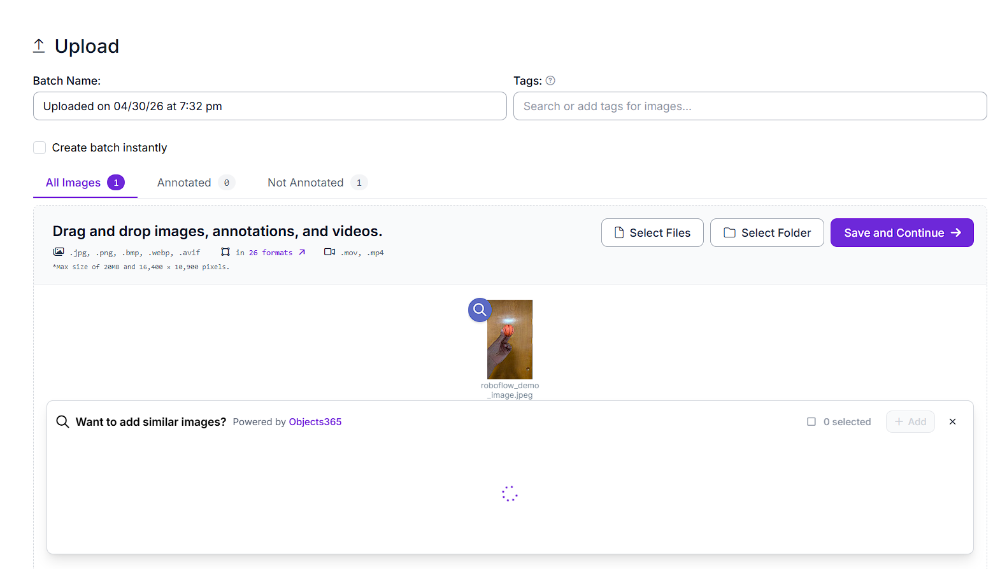
 Uploaded images appear in the upload batch before saving. If you upload a video, Roboflow asks how many frames per second to extract.
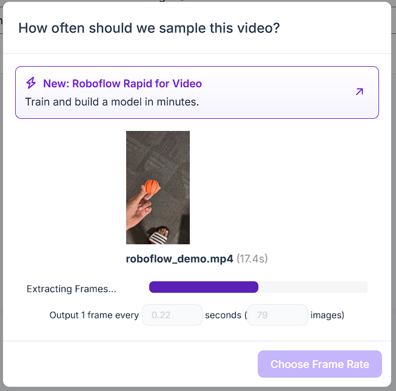
 For video uploads, choose a frame rate that produces enough varied images. For a 30-second walkthrough video choose as many frames per second as gives you around 80 images from one recording. For a longer video lower the rate to avoid too many nearly identical frames. Click Choose Frame Rate to confirm. Roboflow processes the video and saves each extracted frame as a separate image in your project. After uploading you will see all your images in a grid. Roboflow flags any images it cannot read.
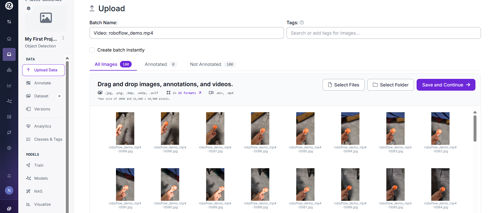
 After processing, Roboflow shows extracted frames in a grid. Images marked Not Annotated in yellow have no labels yet. That is expected: you will label them in the next lesson. Press Save and Continue . You will then see the annotation part. Step 9 — Save and continue Click Save and Continue in the upper right corner. Roboflow uploads and processes all your images. Depending on how many you uploaded this takes 30 seconds to 2 minutes. When it finishes you will see the Annotate section of your project with your images ready to label. This is where the next lesson begins.
Mark as Complete
[Previous← PA.2 Setup](?lesson=projA-vscode)
[NextPA.4 Labeling in Roboflow →](?lesson=projA-labeling)

---

## Labeling Your Images in Roboflow


---

A label is a rectangle you draw around your object in each image. This rectangle tells the model exactly where the object is and what it is called. The model learns by comparing its own predicted boxes to your labeled boxes during training. If your labels are sloppy the model learns sloppiness. If they are tight and consistent the model learns to detect accurately.
There are two ways to label in Roboflow. The old way is to draw every box yourself by hand. The new way, which we will use, is to let Roboflow's AI label the entire batch automatically, then manually fix only the images it got wrong. This is 5 to 10 times faster and produces the same quality result.

### Step 1 --- Open the annotation section
In your Roboflow project click **Annotate** in the left sidebar. You will see three columns: **Unassigned**, **Annotating**, and **Dataset**.
Images just uploaded with no labels yet.
Images currently being worked on.
Fully labeled images ready for training.
All your uploaded images should appear in the Unassigned column.

### Step 2 --- Use Auto-Label to annotate the entire batch
Instead of opening images one by one, we will label everything at once using Roboflow's AI Auto-Label feature.
Click **Auto-Label** at the top of the Unassigned column. A panel opens on the right side of the screen.
Use Auto-Label Entire Batch to label the uploaded images at once.
Click **Auto-label entire batch** to apply to all your uploaded images at once rather than one at a time.
You will see two fields to fill in:
Class Name: type the exact class name you used when creating the project. For example: ball . Description: write a short plain-English description of what your object looks like. Be specific. This description is what the AI uses to find your object in each image.
Good description example for a ball: **A miniaturized basketball, small and orange with black lines, typically sitting on a flat surface.**
Good description example for a cone: **A bright orange traffic cone, roughly triangular, about 30cm tall.**
The more specific your description the better the AI performs. Mention color, shape, size, and any distinctive markings.
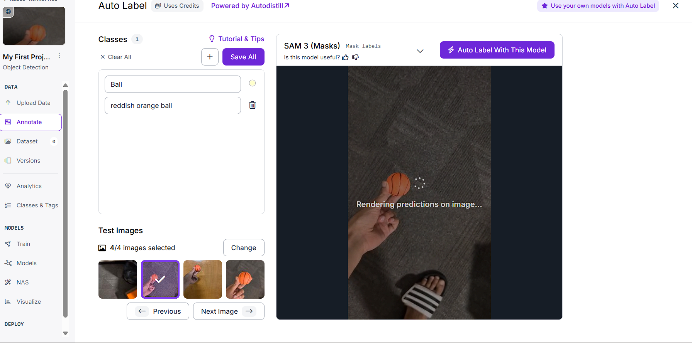

Fill in the class name and a specific object description before generating test results.
Once you have filled in both fields, click **Generate Test Results**. Roboflow runs the AI on a small sample of your images so you can preview the quality before committing.
Review the test results. If the boxes look correct on the preview images, click **Auto-Label** to run on your full batch.
!!! info "About Auto-Label credits"
    Auto-labeling uses Roboflow's AI credits. A free account comes with 20 credits. Labeling one batch of 150 images uses 1 credit. You have more than enough for this exercise.
After auto-labeling finishes, the images move from Unassigned to the Annotating column. Roboflow has now drawn bounding boxes on every image it was confident about.

### Step 3 --- Review and fix images the AI got wrong
Auto-label is not perfect. Some images will have boxes in the wrong place, boxes that are too loose, or images where the object was missed entirely. You now go through and fix these manually.
In the Annotating column, look for images flagged with warnings or that look incorrect in the thumbnail. Click any image to open it in the annotation editor.
The annotation editor looks like this:
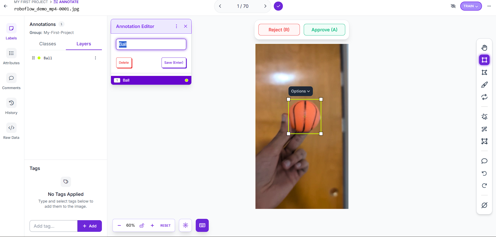

The annotation editor shows the image, class list, and bounding box controls.
If the box is in the right place and tight around the object: leave it as is and move to the next image. If the box is wrong, click the box to select it and press Delete to remove it. Then draw a new one manually as described in Step 4. If the object is in the image but no box was drawn, the AI missed it. Draw the box manually as described in Step 4.
Press the right arrow key to move to the next image. Press the left arrow key to go back.
!!! info "Fix the obvious errors first"
    You do not need to fix every single image perfectly. Aim to correct obvious errors: boxes on the wrong object or no box at all where one should be. Small imperfections in box tightness on a few images will not meaningfully hurt your model.

### Step 4 --- How to draw a manual bounding box
For any image where the AI missed the object or drew the wrong box, draw the correct box yourself.
Press the **B** key to activate the Bounding Box tool. You can also click the rectangle icon in the right toolbar.
Click and drag across your object from one corner to the opposite corner. Release the mouse. A popup appears asking for the class name. Type your class name and press Enter.


Draw the bounding box tightly around the object.
The box appears highlighted on the image.
Shortcut Action B Activate bounding box tool Right arrow Next image Left arrow Previous image Delete Remove selected box Ctrl+Z Undo last action Escape Deselect current tool

#### Labeling rules for manual boxes
Draw tight. The box edge should touch the outer boundary of the object on all four sides. Loose boxes include background pixels which confuse the model about where the object ends. Label every instance. If your object appears twice in one image draw two boxes. Missing an instance penalizes the model during training for detecting something you left unlabeled. Skip heavily occluded instances. If less than 20 percent of the object is visible skip it. A barely visible instance adds noise without useful signal.

### Step 5 --- Add images to the dataset and approve all
After reviewing and fixing an image, click the checkmark button in the top right of the annotation editor.


Use the approve control after the label is correct.
A popup appears. The dropdown labeled **TRAIN**, **VALID**, or **TEST** determines which split this image goes into. Choose a reasonable split.
Once you have gone through all images, return to the main Annotate view. Click **Approve All** to move all reviewed images to the Dataset column in one action.
!!! tip "Approve All when auto-label quality is high"
    If you have a large number of images and most of the auto-labels look correct, you can click **Approve All** from the Annotating column without opening each image individually. Then spot-check 10 to 15 images at random to confirm quality. This is the workflow professional data teams use when auto-label accuracy is high.

### What You Now Have
All your images are in the Dataset column with bounding box labels. The AI did most of the work. You corrected the mistakes. You are ready to generate a dataset version with augmentation, which is covered in the next lesson.

### Labeling Rules
Rule 1: Draw the box tightly around the object. The box edge should touch the outer boundary of the object on all four sides. Do not leave empty space between the object and the box edge. Why: loose boxes include background pixels as part of the object. The model learns that background is part of what it is looking for and performance drops in new environments. Rule 2: Consistent tightness throughout the entire dataset. If you draw tight boxes on the first 50 images and loose boxes on the next 100, the model receives conflicting information about where the object boundary is. Why: inconsistent labels are noise. Noise lowers the ceiling on final model accuracy regardless of how many images you have. Rule 3: Skip instances that are less than 20 percent visible. If the object is heavily obscured by another object or cropped by the image edge, skip it. Why: a barely visible instance provides very little useful signal and the model may learn to look for objects that are mostly hidden, which is not useful for your use case. Rule 4: One class only for this exercise. Do not add a second label class even if you have a second interesting object in your images. Adding a second class doubles the labeling work and training time. Master single-class detection first.
!!! info "Time estimate"
    Labeling 150 images where your object appears once per image takes roughly 30 to 45 minutes at a steady pace. If you use Label Assist for the second half after 50 manual labels, the total time drops to about 20 minutes. There is no shortcut to this step and label quality is the single largest factor in your final model accuracy. A model trained on 150 clean images consistently outperforms a model trained on 500 sloppy images.

---

## Generating and Exporting Your Dataset


---

This lesson teaches augmentation, dataset versioning, and how to get the dataset into Colab in the format YOLO26 expects. This lesson produces the download snippet used in PA.6.

### Step 0 --- Verify your train / valid / test split before doing anything
Before generating a version, check that your images are divided correctly across the three splits. Click **Dataset** in the left sidebar. At the top of the page you will see three numbers showing how many images are in Train, Valid, and Test.
Check that the train, validation, and test split counts are reasonable.
The images the model learns from directly. Target: roughly 70 percent of your total images. For 150 images: around 105 in train.
The images used to check progress during training. Target: roughly 20 percent of your total images. For 150 images: around 30 in valid.
The images looked at only once after training is finished to get an honest estimate of real-world accuracy. Target: roughly 10 percent. For 150 images: around 15 in test.

#### Ideal Split Table
Total images Train Valid Test 100 70 20 10 150 105 30 15 200 140 40 20 300 210 60 30
If your numbers look roughly right, continue to Step 1.
If your split is badly unbalanced, for example 140 train and 5 valid, go back to the Dataset tab, select some images manually, and reassign them using the split dropdown before generating a version.
!!! warning "Keep validation large enough"
    A valid set that is too small gives you unreliable accuracy readings during training. You may see the validation curve jump around wildly rather than showing a clear trend. Aim for at least 20 images in valid no matter how small your total dataset is.

### What is dataset versioning?
In Roboflow, a dataset version is a frozen snapshot of your images at a specific point in time with a specific set of preprocessing and augmentation settings baked in. Think of it like saving a named checkpoint. You can create multiple versions of the same dataset, one with light augmentation and one with heavier augmentation, and compare how each affects training accuracy. Once a version is generated it never changes, so your experiments are reproducible.

### Step 1 --- Navigate to the Generate section
Click **Versions** in the left sidebar. You will see a page with two sections: Preprocessing and Augmentation.
The Versions page is where preprocessing and augmentation settings are configured.

### Step 2 --- Preprocessing settings
Preprocessing modifies your images before they reach the model. Leave the default settings exactly as they are. Roboflow has already applied two sensible defaults:
Auto-Orient: corrects rotation metadata from phone cameras. Without this fix the model sees sideways images during training. Resize to 416x416: every image is resized to this square before training begins. Roboflow automatically adjusts all your bounding box coordinates to match the new dimensions so your labels remain accurate after resizing.
!!! info "Why 416 and not 640?"
    Larger input images give the model more detail to work with but cost significantly more compute time per image. 640x640 is common for production models with GPU access. We use 416x416 because it runs at acceptable speed on a CPU laptop during inference while retaining enough detail to reliably detect a single prominent object like a ball or cone in the frame. If you later find the model misses small distant objects, retraining at 640 is the first thing to try.

### Step 3 --- Augmentation settings
Augmentation creates modified copies of your training images. Each augmented copy is a new training example showing the object under a slightly different condition. This expands your effective dataset size and teaches the model to be robust to variation.
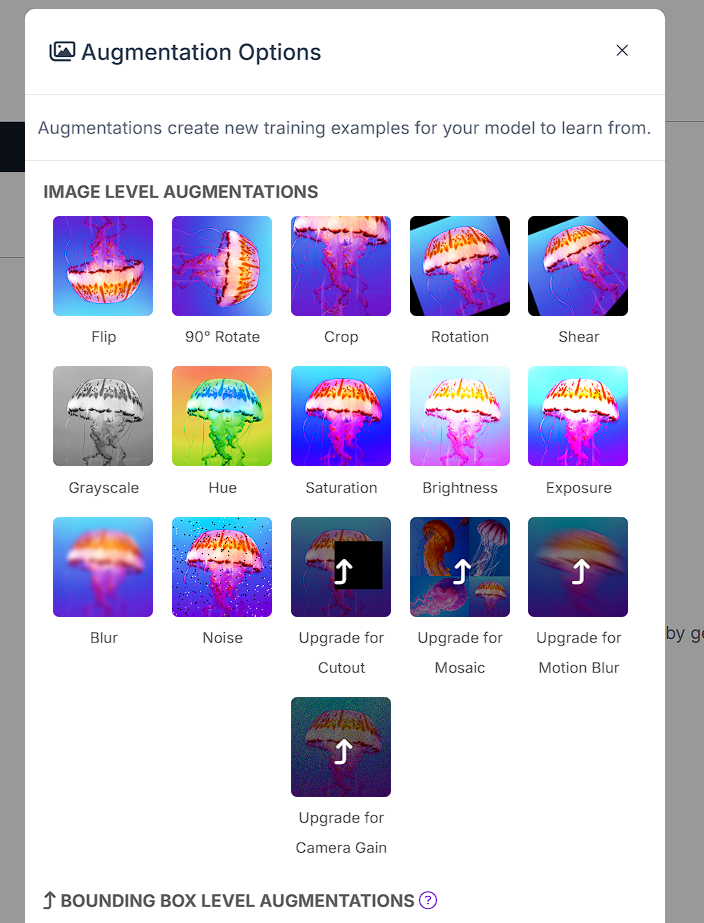

Choose only the augmentation options needed for this first detector.
Enable these augmentations and set the values shown:
Augmentation Setting Why Flip Horizontal: ON Your object looks valid when mirrored. A ball on the left side of frame and a ball on the right side should both be detected. Rotation ON, between -15 and +15 degrees Cameras are rarely perfectly level. Small tilts should not confuse the model. Brightness ON, between -25% and +25% Your robot will operate in different lighting conditions. The model should not depend on a specific brightness level. Blur ON, up to 1.5 pixels Images from a moving robot can be slightly blurry due to motion. Training on slightly blurred images improves detection on real video frames.
Do **not** enable these for this exercise: rotation beyond 15 degrees, Cutout or Mosaic, or Grayscale.
!!! warning "More augmentation is not always better"
    Each augmentation type multiplies your dataset but also adds visual variation that the model must learn to ignore. On a small dataset of 150 images, extreme augmentation can confuse the model more than it helps. Start with the four settings above and add more only if your validation accuracy is low.

### Step 4 --- Set the augmentation multiplier
Roboflow shows a multiplier that controls how many augmented copies to generate per original image. Set this to **3x**.
With 150 original training images and 3x augmentation you get approximately 450 training images. This is a good size for a single-class detector on a simple object.

### Step 5 --- Generate the version
Click **Generate** at the bottom of the page. Roboflow processes your images and augmentations. This takes 1 to 3 minutes depending on the number of images.
When generation finishes you will see a summary showing the total image counts for train, valid, and test including augmented images.
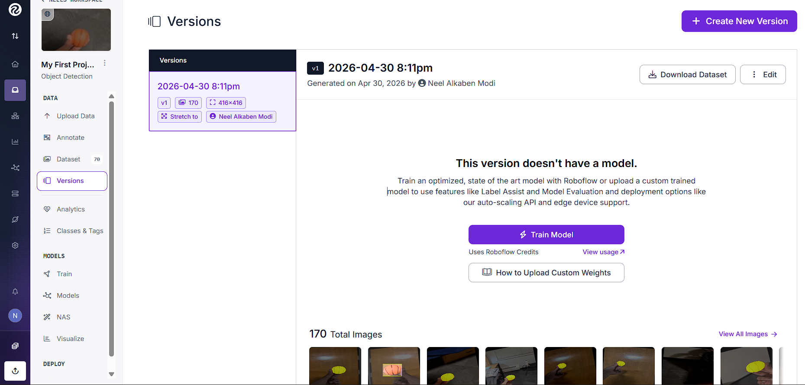

The generated version summary shows the finalized dataset version.

### Step 6 --- Export the dataset
Click the **Export Dataset** button on the version summary page. A dialog appears asking for the export format.
Select YOLO26 and choose the download-code option.
Select **YOLOv26** from the format dropdown.
!!! info "What YOLOv26 export creates"
    The YOLOv26 format creates the structure Ultralytics expects automatically: `train/images`, `train/labels`, `valid/images`, `valid/labels`, `test/images`, `test/labels`, and `data.yaml` listing class names and folder paths. You pass `data.yaml` to the YOLO training command and it finds everything else automatically.

### Step 7 --- Get the download code snippet
After selecting YOLOv26, choose **Get download code** instead of downloading a zip file. Roboflow generates a Python code snippet.
Copy the generated Python snippet for the Colab training notebook.
The snippet looks like this. Your values will differ:
Roboflow download snippet
```python
from roboflow import Roboflow
rf = Roboflow(api_key="YOUR_API_KEY_HERE")
project = rf.workspace("your-workspace-name").project("your-project-name")
version = project.version(1)
dataset = version.download("yolo26")
```
Copy this snippet. You will paste it into your Colab training notebook in lesson PA.6. Do not share your `api_key` publicly: it is tied to your Roboflow account and allows anyone with it to read and modify your projects.
!!! tip "Save the snippet locally"
    Save this snippet in a text file in your project folder right now. Colab sessions reset when you close them. Having the snippet saved locally means you can re-download your dataset in under 10 seconds whenever you start a new Colab session, without going back through the Roboflow interface.

### What You Now Have
A Roboflow project with 150+ labeled images. A dataset version with augmentation applied. A Python download snippet ready for Colab.
The next lesson uses this snippet to download the dataset into Colab, runs the training command, and produces your `best.pt` model file.

---

## Training in Google Colab


---

Training runs in Google Colab because the GPU makes this step fast. Inference runs locally later; training is the one part where cloud GPU is the right tool.
[Open in Colab →](https://colab.research.google.com/github/purwar-lab/ml-for-robotics-/blob/main/notebooks/projA-training.ipynb)

### Why Colab For Training?
Training 50 epochs on 150 images can take 2-4 hours on a CPU. A free Colab T4 GPU usually finishes this exercise in about 8-12 minutes.
Open the notebook in Colab. Go to Runtime → Change runtime type . Choose T4 GPU and click Save. Check Runtime → View resources to confirm GPU memory appears.
!!! warning "Colab free tier limit"
    Colab free tier gives limited daily GPU time, but this exercise only needs about 10 minutes. Do not leave the notebook idle because Colab can disconnect and clear the session.

### Training Notebook Cells
Cell 1: Install dependencies
```python
!pip install ultralytics roboflow -q
```
`-q` means quiet; it suppresses the long install log.
Cell 2: Check GPU
```python
import torch

print(f"CUDA available: {torch.cuda.is_available()}")
print(f"GPU: {torch.cuda.get_device_name(0) if torch.cuda.is_available() else 'None - check runtime type'}")
```
If this prints `None`, switch the runtime to GPU before training.
Cell 3: Download dataset from Roboflow
```python
from roboflow import Roboflow

rf = Roboflow(api_key="YOUR_KEY_HERE")
project = rf.workspace("YOUR_WORKSPACE").project("YOUR_PROJECT")
version = project.version(1)
dataset = version.download("yolov8")
```
Paste your own Roboflow snippet from PA.5. Your API key, workspace, project, and version will differ.
Cell 4: Inspect dataset structure
```python
import os

dataset_path = "YOUR-PROJECT-NAME-1"  # folder Roboflow created
for split in ["train", "valid", "test"]:
    images = len(os.listdir(f"{dataset_path}/{split}/images"))
    labels = len(os.listdir(f"{dataset_path}/{split}/labels"))
    print(f"{split}: {images} images, {labels} labels")
```
A mismatch between images and labels means the export or dataset path is wrong. Fix that before training.
Cell 5: Look at one label file
```python
import random

label_files = os.listdir(f"{dataset_path}/train/labels")
sample = random.choice(label_files)
with open(f"{dataset_path}/train/labels/{sample}") as f:
    content = f.read()
print(f"File: {sample}")
print(f"Contents:\n{content}")
print("\nFormat: class_id  x_center  y_center  width  height (all normalized 0-1)")
```
This connects the raw YOLO label numbers back to the normalized `xywh` format from PA.0.
Cell 6: Visualize one training image
```python
import cv2
import matplotlib.pyplot as plt
import numpy as np

img_dir = f"{dataset_path}/train/images"
lbl_dir = f"{dataset_path}/train/labels"

img_file = random.choice(os.listdir(img_dir))
lbl_file = img_file.replace(".jpg", ".txt").replace(".png", ".txt")

img = cv2.imread(f"{img_dir}/{img_file}")
img = cv2.cvtColor(img, cv2.COLOR_BGR2RGB)
h, w = img.shape[:2]

with open(f"{lbl_dir}/{lbl_file}") as f:
    for line in f:
        parts = list(map(float, line.strip().split()))
        cx, cy, bw, bh = parts[1]*w, parts[2]*h, parts[3]*w, parts[4]*h
        x1, y1 = int(cx - bw/2), int(cy - bh/2)
        x2, y2 = int(cx + bw/2), int(cy + bh/2)
        cv2.rectangle(img, (x1,y1), (x2,y2), (0,255,0), 2)

plt.imshow(img)
plt.title(f"Sample: {img_file}")
plt.axis("off")
plt.show()
```
Always look at your labels before training. If the box is wrong, the model is not the problem yet.
Cell 7: Train YOLO26n
```python
from ultralytics import YOLO

model = YOLO("yolo26n.pt")   # start from pretrained nano weights

results = model.train(
    data=f"{dataset_path}/data.yaml",
    epochs=50,
    imgsz=416,
    batch=16,
    name="my_detector",
    patience=15,          # stop early if val loss stops improving
    save=True,
    device=0              # GPU device 0 - auto-falls back to CPU
)
```
Argument Value What it means data data.yaml Roboflow config listing class names and folder paths. epochs 50 Loop through the full training set 50 times. Enough for small datasets. imgsz 416 Resize images to 416x416. Larger is more accurate but slower. batch 16 Process 16 images at once. Reduce to 8 if Colab runs out of memory. patience 15 Stop early if validation accuracy stops improving. device 0 Use GPU device 0, with CPU fallback if needed.
Cell 8: Find trained weights
```python
import glob

weights = glob.glob("runs/detect/my_detector/weights/best.pt")
print(f"Best weights saved at: {weights[0]}")
```
`best.pt` is saved at the epoch with the best validation accuracy, not necessarily the last epoch.

---

## Reading the Training Results


---

Training does not end when the progress bar reaches 100%. The output files tell you whether your model is reliable enough for robot control.

### Training Output Folder
runs/detect/my_detector/
├── weights/
│   ├── best.pt      <- use this: best validation accuracy
│   └── last.pt      <- last epoch, not necessarily best
├── results.csv      <- metrics per epoch as numbers
├── results.png      <- metric charts over time
├── confusion_matrix.png
├── PR_curve.png
└── val_batch0_pred.jpg  <- sample validation predictions

### Key Metrics
Metric Meaning How to read it mAP50 Mean Average Precision at 50% IoU. Headline accuracy. For a simple single-class detector, expect roughly 0.85-0.97. Below 0.70 usually means data or labels need work. Precision Of all predicted boxes, how many were correct? High precision means few false positives. The model is not hallucinating objects. Recall Of all real objects, how many did the model find? High recall means few missed objects. Box loss How wrong the predicted box coordinates are. Should decrease over time. Spikes can indicate noisy labels or unstable training. Class loss How wrong the predicted class label is. For one-class projects this should become low quickly.
IoU means Intersection over Union: how much the predicted box overlaps the true box as a fraction. An IoU of 0.5 means the overlap is good enough to count for mAP50.
!!! tip "Precision-recall tradeoff"
    Lowering the confidence threshold increases recall but decreases precision. You catch more real objects but accept more false positives. Raising the threshold does the opposite. The `conf=0.5` setting in your inference code is where you choose this tradeoff for your application.

### Healthy vs. Unhealthy Curves
Healthy train loss and val loss both decrease Overfit train loss decreases while val loss stops or rises Underfit both losses stay high and barely move
If your results are weak, do not guess at model code first. Open `val_batch0_pred.jpg`, inspect predictions, fix labeling problems, add 50-100 more varied images, and train again.

---

## Running Inference Locally


---

Now move `best.pt` from Colab to your local VS Code project and run it on a live webcam. This proves your trained model works outside the cloud notebook.
In Colab, open the Files panel on the left. Navigate to runs/detect/my_detector/weights/ . Right-click best.pt and download it. Move best.pt into your local my-detector folder.

### Create `detect_webcam.py`
detect_webcam.pyRun locally
```python
import cv2
from ultralytics import YOLO

# Load your trained model
model = YOLO("best.pt")

# Open webcam (0 = default webcam)
cap = cv2.VideoCapture(0)
if not cap.isOpened():
    print("Error: Could not open webcam")
    exit()

print("Press Q to quit")

while True:
    ret, frame = cap.read()
    if not ret:
        break

    # Run detection
    results = model(frame, imgsz=416, conf=0.5, verbose=False)

    # Draw results on the frame
    annotated = results[0].plot()

    # Show FPS
    fps = cap.get(cv2.CAP_PROP_FPS)
    cv2.putText(annotated, f"Model: yolo26n (your data)",
                (10, 30), cv2.FONT_HERSHEY_SIMPLEX, 0.7, (0,255,0), 2)

    cv2.imshow("My Detector", annotated)

    key = cv2.waitKey(1) & 0xFF
    if key == ord("q") or key == ord("Q") or key == 27:  # q, Q, or Esc
        break
    # also exit if the user clicks the window's X button
    if cv2.getWindowProperty("My Detector", cv2.WND_PROP_VISIBLE) < 1:
        break

cap.release()
cv2.destroyAllWindows()
```
Line or setting Meaning results[0].plot() Ultralytics draws all boxes, class names, and confidence scores on the frame. conf=0.5 Minimum confidence required before a detection is shown. verbose=False Suppresses per-frame terminal output. cv2.VideoCapture(0) Opens the default camera. Try 1 if the wrong camera opens.

### Run It
Run webcam detector
```bash
python detect_webcam.py
```
!!! tip "Tune confidence and image size"
    If you see too many false positives, increase `conf` to 0.65 or 0.70. If the model misses the real object, decrease it to 0.40. If the laptop feels slow, try `imgsz=320`; smaller images are faster but slightly less accurate.

---

## Understanding the Model Output


---

Project 1 does not use `.plot()`. It reads raw YOLO outputs directly so it can compute object center, object area, and motor commands. This lesson shows the exact data you will use.
raw_output_debug.pyRun locally
```python
import cv2
from ultralytics import YOLO

model = YOLO("best.pt")
cap = cv2.VideoCapture(0)

while True:
    ret, frame = cap.read()
    if not ret:
        break

    results = model(frame, imgsz=416, conf=0.5, verbose=False)

    # Look at the raw output - don't use .plot() yet
    for r in results:
        print(f"\nFrame detections: {len(r.boxes)}")

        for i, box in enumerate(r.boxes):
            # Bounding box in pixel coordinates (x1,y1,x2,y2)
            x1, y1, x2, y2 = box.xyxy[0].cpu().numpy()

            # Center of the box
            cx = (x1 + x2) / 2
            cy = (y1 + y2) / 2

            # Area of the box (proxy for distance)
            area = (x2 - x1) * (y2 - y1)

            # Confidence score
            confidence = float(box.conf[0])

            # Class index and name
            class_id   = int(box.cls[0])
            class_name = model.names[class_id]

            print(f"  Detection {i}: {class_name} ({confidence:.0%} confident)")
            print(f"    Box:    ({x1:.0f}, {y1:.0f}) to ({x2:.0f}, {y2:.0f})")
            print(f"    Center: ({cx:.0f}, {cy:.0f})")
            print(f"    Area:   {area:.0f} px²")

    if cv2.waitKey(1) & 0xFF == ord("q"):
        break

cap.release()
cv2.destroyAllWindows()
```
Attribute Type What it contains r.boxes list-like object All detections in this frame. Empty means nothing was detected. box.xyxy[0] tensor [x1, y1, x2, y2] in pixel coordinates. .cpu().numpy() conversion Moves data from GPU memory to CPU and converts it to a NumPy array for math. box.conf[0] float tensor Confidence score from 0 to 1. box.cls[0] int tensor Detected class index. model.names dict Maps class index to class name, such as {0: "ball"} .
!!! tip "Bridge to Project 1"
    Look at the `_detect()` method in `obj_track_adv.py`. It does exactly this: loops through `r.boxes`, checks the class name, computes the area, and returns the bounding box coordinates. Now those attribute names should look familiar instead of mysterious.

---

## Preparing for Project 1


---

You now have the trained detector and the vocabulary needed to connect it to a robot-control loop. This checklist confirms you are ready for the remaining robot projects.

### What You Now Have
A trained best.pt file specific to your target object. Understanding of what YOLO outputs and how to read it. A working local Python environment with the required packages. Intuition for confidence thresholds, bounding boxes, centers, and areas.

### Rename The Weights
Rename `best.pt` to something descriptive, such as `ball_detector.pt` or `mug_detector.pt`. In Project 1, update the Tracker initialization so the first argument is your model file and the second argument exactly matches the class name you used in Roboflow.
Tracker initialization for Project 1Run locally
```python
tracker = Tracker("ball_detector.pt", "ball")
```

### Readiness Checklist
best.pt is in the my-detector folder and webcam detection works. The model correctly detects the target object from at least 1 meter away. The model runs at acceptable speed. Even 5 fps is enough for Project 1. You understand what box.xyxy , box.conf , and box.cls contain. mAP50 on the validation set was above 0.75.
!!! warning "Do not move on with a weak model"
    If `mAP50` is below 0.75, the tracker will behave erratically and it will be hard to tell whether the problem is the model or the control code. Add 50-100 more images with varied backgrounds and retrain. This almost always helps.
!!! tip "Next step"
    You have the model. [Exercise B](?lesson=projB-overview) connects it to a live phone camera stream, then Exercise C builds the encoder movement foundation before Project 1 combines everything.

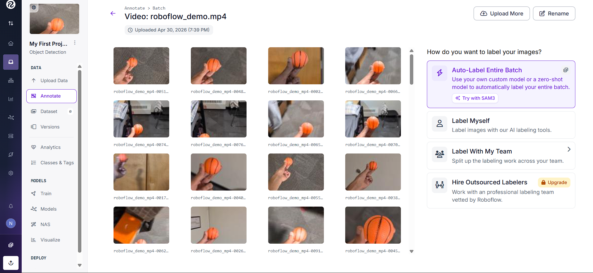

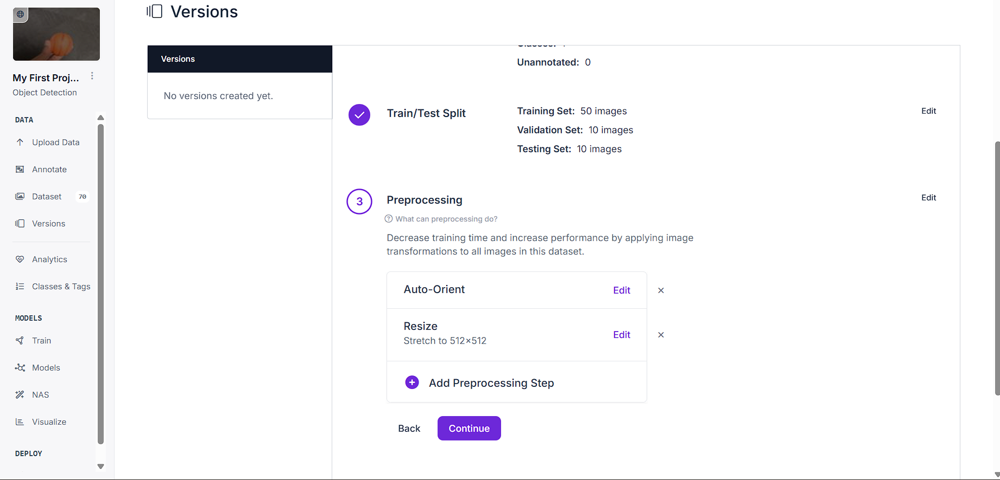


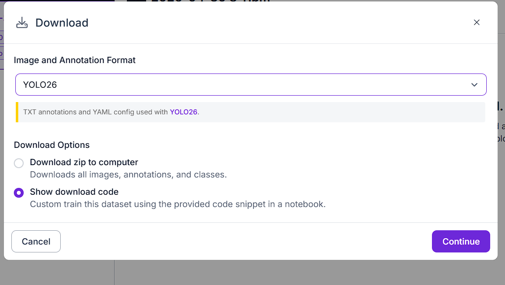

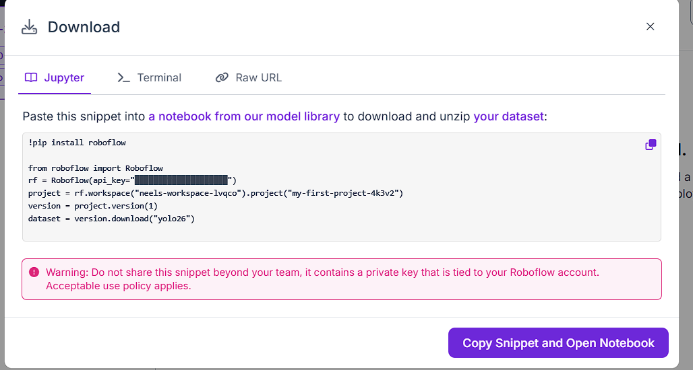
